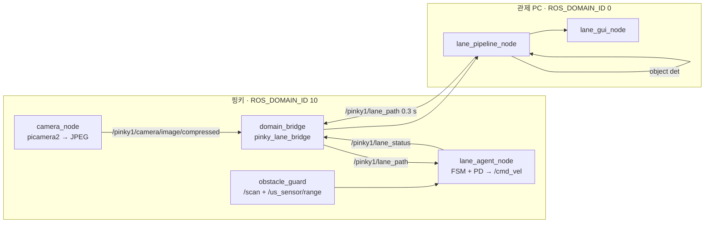

# pinky_pro_team11 — mini_project_2 · 차선 추종 자율주행

[Pinky Pro](https://github.com/pinklab-art/pinky_pro) 한 대가 **마스킹 테이프로 만든 차선**을 카메라로 인식해
스스로 주행한다. 카메라 영상은 관제 PC 로 보내 YOLO 로 세그멘테이션하고, PC 가 0.3 초마다
**차선 중앙 기준점**을 로봇에 돌려주면 로봇이 그 점을 따라간다. 횡단보도에서는 3 초 멈췄다 출발하고,
장애물이 앞에 있으면 멈췄다가 치워지면 스스로 다시 간다.

> mini_project_1(2 대 멀티로봇 관제) 문서는 [`docs/mini_project_1.md`](docs/mini_project_1.md) 로 옮겼다.
> 이 브랜치는 그 코드에서 분기했고, 데드맨 스위치·브릿지 설정·GUI 패턴을 그대로 재사용한다.

---

## 과제 요구사항 ([`MVP_subject.html`](MVP_subject.html))

| # | 요구 | 구현 |
|---|---|---|
| 1 | **차선 추종 주행** | YOLO seg(`left` / `right`) → 좌·우 영역 중심점의 중점 = target point |
| 2 | **중앙 정렬 주행** | `ErrorX = target_x − 화면중앙` 을 PD 로 각속도에 반영, 20 Hz |
| 3 | **횡단보도 일시 정지** 후 재주행 | 객체 det 로 검출 → 3 초 정지 → odom 주행거리 기준으로 재래치 방지 |
| 4 | **장애물 감지·대기**, 제거 시 **자동 재주행** | 라이다 전방 섹터 + 초음파 병용 → 1 초 비면 자동 복귀 |

**코스 조건**: 직접 제작 · S 자 1 구간 이상 · 90° 이상 전환 2 회 이상 · 횡단보도 포함
**평가**: 차선 인식 정확도 · 중앙 정렬 안정성 · 횡단보도 정지 · 장애물 대응 · 완주 · 코드 완성도

> 신호등(빨강 정지 / 초록 출발)은 원문에 없는 **팀 자체 확장**이다. 필수 4 항목을 먼저 끝내고 얹는다.

---

## 현장 사실

### 하드웨어

| | | | |
|---|---|---|---|
| SBC | 라즈베리파이 5 (8 GB) | LIDAR | RPLiDAR C1, 바닥에서 **12.5 cm** |
| 카메라 | **5 MP CSI**, 지면 기준 ≈ 6.5 cm, 8° 하향 (URDF) | 초음파 | US-016 → `us_sensor/range` |
| IR | TCRT5000 3 채널 (미사용) | IMU | BNO055 → `imu_raw` |
| 크기 | 110 × 120 × 142 mm | 배터리 | 약 3 시간, **7 V 이하면 충전 불가** 가능 |

### 소프트웨어 — 알고 시작해야 하는 것

- **카메라 ROS 노드가 없다.** `bringup_robot.launch.xml` 은 description · sllidar · bringup · battery 만 띄운다. 직접 만든다.
- **카메라가 거꾸로 달려 있다.** 보정 방향을 잘못 고르면 좌/우 차선이 뒤바뀌어 조향이 반대로 나간다. 수집 전 `record_drive.py --snap` 으로 확인한다.
- 카메라 접근은 `picamera2` (`RGB888`, 640×480). `cv2.VideoCapture` 가 아니다.
- `pinky_sensor_adc` 도 bringup 에 없다. 초음파를 쓰려면 `ros2 run pinky_sensor_adc main_node` 를 따로 띄운다.
- 코스: **흰 테이프**, 벽도 **흰색**. 색 임계값(HSV) 방식은 벽에 속는다 — YOLO 를 쓰는 실질적 이유다.
- 네트워크: 로봇·PC 모두 외부 공유기. 도메인·워크스페이스는 mini_project_1 설정 유지 (로봇 10, PC 0).

---

## 설계

### 원칙 세 가지

1. **차선 모드에서 Nav2 를 띄우지 않는다.** `/cmd_vel` 발행자는 정확히 하나. 라이다는 12.5 cm 높이라 도색을 못 보므로 costmap 이 차선에 기여하는 정보가 없다.
2. **정지 권한은 로봇에 있다.** PC 는 "무엇이 보이는지" 만 알려주고, 멈출지는 로봇 FSM 이 정한다. PC 가 죽어도 로봇은 멈춰야 한다.
3. **PC 는 로봇이 산술에 쓸 시각을 찍지 않는다.** 이미지 stamp 는 로봇이 한 번 찍고 이후 전부 복사만 한다. 두 기기의 시계가 만날 일이 없으니 라즈베리파이의 RTC 부재가 문제가 안 된다.

### 데이터 흐름



### 인식 — 모델 두 개로 분리

| 모델 | 클래스 | 라벨 | 용도 |
|---|---|---|---|
| `lane_seg` (yolo11n-seg) | `left`, `right` | 폴리곤 | 좌·우 차선 **영역** → `cv2.moments` 중심점 |
| `object_det` (yolo11n) | `crosswalk`, `traffic_light_red`, `traffic_light_green` | 박스 | 정지 판정 |

분리하는 이유: seg 데이터셋은 모든 인스턴스가 폴리곤이어야 해서 합치면 라벨링이 몇 배가 되고, 차선(전 프레임)과 객체(일부 프레임)의 클래스 불균형이 생기며, 신호등을 나중에 LED 로 바꿀 때 객체 모델만 재학습하면 된다.
학습은 별도 GPU 에서 하고 `best.pt` 만 옮긴다. 추론은 CPU/GPU 를 벤치로 실측해 정한다 (0.3 초 주기면 CPU 로 충분할 가능성이 높다).

### 조향 — 픽셀 ErrorX + PD

```
error = (target_x − W/2) / (W/2)            # −1 … +1
ω     = −(Kp·error + Kd·Δerror/Δt)
v     = v_max · (1 − k·|error|)             # 크게 틀어졌으면 감속
```

호모그래피·미터 변환 없이 시작한다. 정지 거리 판정이 픽셀로 부족해지면 그때 IPM 을 추가한다.

### 한쪽 차선만 보일 때 — 90° 코너에서 반드시 생긴다

```
양쪽 다 보임 → target_x = (left_cx + right_cx) / 2
한쪽만 보임 → target_x = seen_cx ± half_lane_px      # 직전 관측의 이동 중앙값
둘 다 없음  → LANE_LOST: 마지막 조향 유지 + 서행으로 odom 0.25 m 까지 재포착 시도, 실패 시 정지
```

블라인드 거리는 시간이 아니라 **주행거리**로 센다. 이 거리를 늘려야만 코너를 돈다면 코드가 아니라 코너 반경이나 카메라 틸트를 고칠 신호다.

### 주행 FSM (로봇)

```
우선순위: ESTOP > LINK_LOST > OBSTACLE_WAIT > LANE_LOST
         > LIGHT_TIMEOUT > LIGHT_WAIT > CROSSWALK_STOP > CROSSWALK_CLEAR > CRUISE > IDLE
```

- **OBSTACLE_WAIT**: 라이다 또는 초음파 2 연속 감지 → 정지. 1 초 비면 **자동 복귀** (원문 요구). 수동 해제인 ESTOP 과 다른 상태다.
- **CROSSWALK_STOP**: 3 초 → CLEAR. 재래치는 `travelled ≥ crosswalk_length + 0.25 m` 까지 막는다. 3 초 서 있던 로봇은 느리므로 시간 쿨다운은 실패한다.
- **LIGHT_WAIT**: 확정 RED 로 진입, 확정 GREEN 으로 해제. 시야에서 1 초 사라지면 오검출로 보고 복귀. 60 초 넘으면 `LIGHT_TIMEOUT` 으로 **계속 정지** + GUI `[강제 출발]`. 자동 재개는 넣지 않는다.
- 디바운싱: 확정 3 프레임 / 해제 5 프레임.

### 안전

- `link_watch.py` (mini_project_1) 를 수정 없이 두 개 — PC 하트비트 3 s, `lane_path` 0.9 s. 끊기면 감속 정지, 마지막 경로를 계속 타지 않는다.
- 정지 중에도 zero Twist 를 20 Hz 로 발행. Nav2 가 없으니 발행 중단으로 대체하지 않는다.
- 영상·`lane_path` 는 **BEST_EFFORT depth 1**. RELIABLE 은 재연결 시 낡은 경로를 재생해 로봇을 혼자 출발시킨다 (mini_project_1 의 `restore_grace` 가 생긴 이유).
- 이미지 스트림은 **별도 `domain_bridge` 프로세스**(`bridge_lane.yaml`). 안전 필수 하트비트와 같은 프로세스에 두지 않는다.

### 코스 규격 (카메라 기하에서 역산)

- **차선 폭 0.30 m** · **코너 반경 ≥ 0.30 m 원호** (직각 금지) · 장애물 **높이 ≥ 15 cm**
- 카메라 6.5 cm + 8° 하향이면 지면이 약 0.12 m 앞부터 보인다. 코너에서 차선이 빠지면 틸트 15~20° 상향을 검토한다.

---

## 데이터 수집

절차와 스크립트는 [`tools/README.md`](tools/README.md).

| | |
|---|---|
| `tools/record_drive.py` | 로봇에서 picamera2 로 mp4 + 프레임별 stamp CSV. `--snap` 으로 장착 방향 확인 |
| `tools/extract_frames.py` | PC 에서 라벨링용 프레임 솎아내기 (흔들린 프레임 제외) |

세션(`course_a`~`e`, `crosswalk`)을 나눠 찍는다 — 세션 단위로 train / val 을 나눠야 검증 점수가 부풀지 않는다.
영상과 함께 `ros2 bag record /odom /scan /tf /tf_static /cmd_vel` 을 남긴다.

**공개 데이터셋**: 차선은 시점(차량 1.5 m vs 우리 6.5 cm)과 클래스(`lane` 1 클래스 vs `left`/`right`) 가 달라 그대로 못 쓴다. A3 용지에 테이프로 차선 조각을 만들어 40 장 찍는 게 더 빠르다. 횡단보도·신호등은 외형이 보편적이라 공개 데이터로 1 차 모델을 만들고 현장 프레임으로 파인튜닝한다.

**Gazebo**: `pinky_gz_sim` 에 카메라 센서가 있고 `pinky_bridge.yaml` 에 `camera/image_raw` 항목만 추가하면 된다. 단 시뮬 영상으로 학습한 YOLO 는 실물에 전이되지 않으므로 시뮬은 **제어·FSM·코스 기하 검증용**이다. 재현에 필요한 실측 항목은 `tools/README.md` §5.

---

## 패키지

| 패키지 | 위치 | 상태 |
|---|---|---|
| `pinky_fleet_msgs` `pinky_fleet_agent` `pinky_fleet_station` | mini_project_1 | 그대로. `link_watch.py` · 브릿지 설정 · GUI 패턴 재사용 |
| `pinky_lane_msgs` | 신규 | `LanePath` `SceneState` `LaneCommand` `LaneStatus` |
| `pinky_fleet_agent/` 확장 | 로봇 | `camera_node` `lane_agent_node` `lane_control` `drive_fsm` `obstacle_guard` |
| `pinky_lane_station` | PC | `lane_pipeline_node` `lane_gui_node` `detectors/` `fake_camera_pub` `fake_lane_robot` |
| `training/` | PC | 데이터셋·학습 스크립트. `COLCON_IGNORE`. 가중치는 git 에 넣지 않는다 |

새 메시지의 필드는 배포 전인 지금 잡는다. `pinky_fleet_msgs` 는 건드리지 않는다 — 필드가 바뀌면 세 머신을 동시에 재빌드해야 한다.

---

## 마일스톤

| | 내용 | 완료 기준 |
|---|---|---|
| M0 | 코스 규격 확정, 카메라 실측 | 축척 도면. **테이프 붙이기 전** |
| M1 | 메시지 + 하드웨어 없는 폐루프 + 추론 벤치 | `fake_lane.launch.xml` 에서 합성 로봇이 합성 차선 추종, pytest 그린, CPU/GPU 표 |
| M2 | 카메라 노드 + 전송 | 640×480@15fps 10 분 p95 < 250 ms, 좌/우 일치 육안 확인 |
| M2.5 | demo 모델 (코스와 병렬) | COCO 가중치로 객체 배관 검증, A3 테이프 40 장으로 차선 demo |
| M3 | 현장 데이터 + 본 모델 | 홀드아웃 세션 mIoU ≥ 0.80 |
| M4 | 실차 차선 주행 + 장애물 | 코스 3/3 완주, 벽 접촉 0, 장애물 자동 재주행, PC 종료 시 1 초 내 정지 |
| M5 | 횡단보도 | 5/5 에서 3.0 ± 0.3 s, 통과당 1 회 — **여기서 과제 필수 4 항목 완료, 태그** |
| M5.5 | 신호등 (확장) | 빨강 정지, 초록 1 초 내 출발, 오검출이 GUI 에 드러남 |
| M6 | 문서 + 평가 리포트 | 인식률 · 중앙 정렬 RMS · 정지 성공률 · 완주율 |
| M7 | 2 대 확장 | `bridge_lane.yaml` 확장, 디텍터 공유 배치 추론 |

---

## 확인이 필요한 것

- 카메라 실측 높이·틸트, 틸트 조절 가능 여부
- `--snap` 으로 고른 장착 방향 보정값 (→ `camera_node` 기본값)
- 초음파 노드가 뜨는지, 유효 거리와 노이즈
- 횡단보도 길이·줄무늬, 신호등 패널 크기·높이
- 공유기 대역 (2.4 GHz 면 영상 5 Mbps 가 빠듯하다)
- 데모가 완전 자율 원테이크인지, 신호등 타임아웃 시 `[강제 출발]` 이 허용되는지
