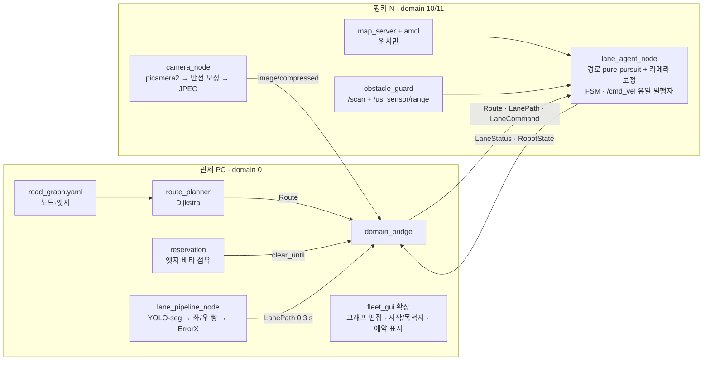

# pinky_pro_team11 — mini_project_2 · 도로망 위 2대 차선 추종 자율주행

[Pinky Pro](https://github.com/pinklab-art/pinky_pro) **2대**가 각자 시작점에서 목적지까지, 마스킹 테이프로 만든
**분기가 있는 도로망**을 카메라로 차선을 인식해 주행한다. 관제 PC 가 라이다 맵 위 도로망 그래프에서
경로를 계산해 로봇에 주고, 로봇은 그 경로를 따라가되 **좌우 위치는 카메라가 본 차선 중앙**으로 맞춘다.
두 대가 폭 20 cm 도로에서 마주치면 비켜갈 길이 없으므로, 관제가 구간을 **예약**해 마주침 자체를 막는다.

> mini_project_1(2 대 멀티로봇 관제) 문서는 [`docs/mini_project_1.md`](docs/mini_project_1.md).
> 이 브랜치는 그 코드에서 분기했고, AMCL·데드맨 스위치·브릿지·GUI 를 그대로 재사용한다.

---

## 과제 요구사항 ([`MVP_subject.html`](MVP_subject.html)) ↔ 구현

| # | 요구 | 구현 |
|---|---|---|
| 1 | **차선 추종** | YOLO-seg `lane` 인스턴스 중 화면 중앙에 가장 가까운 좌/우 쌍 → 중점 |
| 2 | **중앙 정렬** | `ErrorX = target_x − 화면중앙` 을 각속도 보정항으로, 20 Hz. **좌우 위치는 100 % 카메라** |
| 3 | **횡단보도 정지** 후 재주행 | `crosswalk` 인스턴스 하단 y 임계 → 3 s 정지 → 주행거리 기준 재래치 방지 |
| 4 | **장애물 정지**, 제거 시 **자동 재개** | 라이다 전방 섹터 + 초음파 → 1 s 비면 복귀 |
| + | 시작·목적지 지정, **2대 동시** | 도로망 그래프 경로 계획 + 구간 예약 (관제) |

**코스**: 회색 카펫 + 흰 테이프, 흰 폼보드 벽, 도로 폭 약 20~25 cm, 분기·루프·횡단보도 2곳, 직각에 가까운 코너 다수.

---

## 왜 카메라만으로는 안 되는가

분기가 있으면 차선 추종은 세 가지를 모른다: **갈림길에서 어느 쪽**, **여기가 목적지인지**, **교차로에서 어느 차선 쌍이 내 길인지**.
셋 다 "맵 위 내 위치"가 있어야 풀린다. 라이다 맵과 mini_project_1 의 AMCL 이 이미 있으므로 **위치 파악용으로만** 살린다
(`localization_launch.xml` — map_server + AMCL. planner/controller 는 띄우지 않는다).

AMCL 은 5 cm 쯤 흔들려서 차선 중앙 유지에는 못 쓴다. 그건 카메라만 할 수 있다. 역할이 나뉜다:
**맵 경로 = 어느 길로, 카메라 = 그 길의 어디에.**

---

## 아키텍처



### 원칙
1. `/cmd_vel` 발행자는 `lane_agent_node` 하나. Nav2 controller/planner 없음.
2. **정지 권한은 로봇.** 관제는 "가도 되는 지점"(`clear_until`)과 "무엇이 보이는지"만 준다. 관제가 죽으면 로봇은 `link_watch` 로 멈춘다.
3. 이미지 stamp 는 로봇이 찍고 이후 복사만. 두 기기 시계는 만나지 않는다.

---

## 설계

### 도로망 그래프 (`config/road_graph.yaml`)
노드(끝점·분기·횡단보도, map 좌표) + 엣지(구간 중심선 폴리라인, 0.10 m 간격). 기존 `MapCanvas` 클릭으로 편집하고,
라이다 맵 위에 항공 사진을 반투명으로 겹쳐 놓고 찍는다. 코스가 테이프라 바뀔 수 있으니 편집이 쉬워야 한다.
중심선 정확도는 ±5 cm 면 충분하다 — 나머지는 카메라가 메운다.

### 구간 예약 (관제)
```
매 틱, domain_id 오름차순:
  뒤 엣지 해제 — 끝 노드를 0.15 m 지나면
  앞 엣지 예약 — 시작까지 0.40 m 이내이고 비어 있으면 점유 → clear_until 연장
로봇은 clear_until 웨이포인트에서 정지(WAIT_CLEARANCE), 연장되면 재출발
```
같은 엣지 반대 방향 마주침은 배타 점유로 **구조적으로** 불가능하다. 2대 상호 대기 교착(서로의 다음 엣지를 서로가 점유)은
감지해 GUI 경고 + 수동 양보 버튼만 둔다 — 폭 20 cm 도로에서 자동 후진은 위험하다. 데모 시나리오는 시작·목적지 조합을
그래프로 미리 검토해 이 경우를 피한다.

### 인식 (관제 `lane_pipeline_node`)
```
lane 인스턴스마다 샘플 행 y = 0.72·H 에서 폴리곤 교차 x
  좌 = x < W/2 중 최대, 우 = x > W/2 중 최소            # 화면 중앙에 가장 가까운 쌍
  BOTH: 중점 · SINGLE: 보이는 쪽 ± half_lane_px(관측 이력 중앙값) · LOST
error_x = (target_x − W/2)/(W/2)
crosswalk 인스턴스 최하단 y ≥ stop_row_px → N 프레임 확정
```
**분기 모드**: 관제가 로봇 pose 로 분기 노드 반경 0.25 m 안임을 알면 `quality=JUNCTION` 을 보낸다. 로봇은 카메라 보정을
끄고 맵 경로만 따른다. 교차로에서 차선 쌍이 모호해지는 문제를 풀지 않고 **회피**한다.
샘플 행 방식을 쓰는 이유: 곡선 차선의 중심점(moments)은 화면 중앙을 넘어갈 수 있다.

### 제어 (로봇 `lane_agent_node`, 20 Hz)
```
P   = Route lookahead(0.25 m) 점 → TF 로 로봇 좌표
ω_route = 2·v·sin(atan2(P.y, P.x)) / L_d            # pure pursuit
ω_cam   = −(Kp·error_x + Kd·Δerror_x/Δt)
ω = ω_route + w_cam·ω_cam,   w_cam = BOTH 1.0 · SINGLE 0.5 · JUNCTION/LOST/STALE 0
v = v_max · min(1, 1 − k·|error_x|, 1 − k'·|ω|/ω_max),  clear_until 앞에서 감속·정지
```
카메라가 차선을 못 봐도 맵 경로가 끌고 간다 — v2 의 "블라인드 선회"가 필요 없어진다. 대신 `w_cam=0` 이 0.6 m 이상
이어지면 감속·경고(AMCL 만 믿고 오래 달리지 않는다).

### 주행 FSM (로봇)
```
ESTOP > LINK_LOST > OBSTACLE_WAIT > WAIT_CLEARANCE > CROSSWALK_STOP > CROSSWALK_CLEAR
      > ARRIVED > DRIVE(BOTH / SINGLE / JUNCTION / BLIND) > IDLE
```
- **OBSTACLE_WAIT** — 라이다(±35°, 0.18 m) 또는 초음파 ≤ 0.20 m, 2 연속 → 정지. 1 s 비면 **자동 복귀**. 상대 핑키인지 구분하지 않는다 — 예약이 제대로면 여기 오지 않고, 와도 동작은 같다.
- **WAIT_CLEARANCE** — `clear_until` 도달 후 관제 연장 대기. `state_reason = "J1→C1 대기 (pinky1 점유)"`.
- **CROSSWALK_STOP** — 확정 후 3.0 s → CLEAR. 재래치는 `travelled ≥ crosswalk_len + 0.25 m`. 그래프의 crosswalk 노드 반경 밖 트리거는 무시(오검출 방어).
- **ARRIVED** — 목적지 노드 0.10 m 이내 → 정지, 점유 전부 해제.
- 정지 중에도 zero Twist 20 Hz. 종료 시 작별 스핀. 영상·`LanePath` 는 BEST_EFFORT depth 1 — RELIABLE 은 재연결 시 낡은 값을 재생해 로봇을 혼자 움직인다.

### 카메라로 핑키를 인식하지 않는 이유
라이다(12.5 cm)가 핑키(14 cm)를 잡고, 관제가 두 로봇 위치를 안다. "전방에 뭔가 있음 + 상대가 그 근처" = 핑키, 아니면 장애물.
클래스 추가·라벨링 없이 구분되고, 어차피 둘 다 "일단 멈춤"이다.

---

## 절대 위치 — 항공뷰(천장 웹캠) 주, 바닥 마커 보조 (AMCL 대체)

AMCL 이 주행 중 크게 튄다. 2.35×1.25 m 흰 폼보드 상자는 라이다에 직사각형 하나라 붙잡을 특징이 없다.
그래서 위치는 **카메라와 ArUco 마커**로 얻고, 로봇의 `pose_fuser_node` 가 어느 소스든 `PoseFix` 를 받아 odom 과 합쳐
`map→odom` TF 를 낸다 (AMCL 자리). `lane_agent_node` 는 TF 만 읽으므로 변경 없다.

```
[주] 항공뷰   천장 USB 웹캠 → overhead_localizer_node (관제)
              바닥 고정 기준 마커 4장(id 40~43, map 좌표 기지) 네 모서리 ↔ map 으로 호모그래피 H 를 매 프레임 구한다
              핑키 위 마커(id 30/31) 네 모서리를 H 로 map 에 옮겨 위치·yaw. 10~15 Hz, 두 대 동시
              → PoseFix (stamp = 캡처 시각 = 관제 시계, stamp_is_robot_clock=false)
[보조] 바닥   핑키 카메라 → lane_pipeline_node 가 같은 프레임에서 바닥 마커(id 0~13) solvePnP
              → PoseFix (stamp = 이미지 stamp 복사 = 로봇 시계, stamp_is_robot_clock=true)
[로봇] pose_fuser_node   로봇 시계 fix 는 그 시각의 odom 에, 관제 시계 fix 는 (수신 − station_latency 0.15 s) 의 odom 에
                         붙여 map→odom 을 갱신. 큰 점프는 2 연속 일치해야 채택. 15 s 동안 fix 없으면 TF 중단 → 정지
```

**"항공뷰 맵 크기 ↔ nav 맵 크기 비율" 로 바꾸지 않는 이유**: 원근이 있어서 위치마다 수~수십 cm 틀리고, 이미지에 맵 밖
배경이 얼마나 보이느냐에도 흔들린다. 기준 마커 4장으로 H 를 잡으면 배경·원근·카메라 흔들림 모두 무관하다.
기준 마커는 **핑키 위 마커와 같은 높이** 받침 위에 둔다 (높이가 다르면 연직점에서 멀수록 스케일 오차).

**준비 (한 번)**
1. 인쇄: `tools/print_markers.py --ids 40-43 --size 0.10 --label ref`, `--ids 30,31 --size 0.06 --label robot`. 실제 크기(100 %) 로 인쇄해 검은 변을 자로 확인
2. 기준 마커 4장을 코스 네 귀퉁이 안쪽 받침 위에 붙이고 줄자로 벽 안쪽 모서리 기준 좌표를 재서 `overhead.yaml` 에 기입 (지금 값은 자리표시자). 시트의 +x 화살표 방향 = yaw
3. 핑키 위 마커: 라이다 스캔면을 가리지 않는 곳(라이다 위 얇은 판 또는 뒤쪽 데크). 바퀴축 중심에서의 전방 오프셋·각도를 `offset_x`, `yaw_offset` 에
4. 웹캠: 코스 중앙 위 1.8~2.5 m, 렌즈를 바닥에 수직에 가깝게, 노출 고정. `python3 tools/overhead_check.py --config pinky_lane_station/config/overhead.yaml` 로 핑키를 줄자 위치에 놓고 표시 좌표와 비교 (5 cm/5°)
5. (보조 바닥 마커를 쓸 때만) `markers.yaml` 노드 마커 + `tools/calib_intrinsics.py`, `calib_extrinsics.py`

`fake_lane.launch.xml` 은 기본으로 이 경로를 돈다 — 가짜 로봇이 odom 드리프트(2 %/s) 를 넣고, 항공뷰 흉내(참값+잡음, 관제 시계 10 Hz)
와 합성 바닥 마커(파이프라인 경유, 로봇 시계) 두 소스를 같은 `PoseFuser` 로 합친다. AMCL 로 되돌리려면 `use_amcl:=True`.

---

## 메시지 (`pinky_lane_msgs`, 신규)

| 메시지 | 방향 | 핵심 필드 |
|---|---|---|
| `Route` | PC→로봇 (R, TL) | waypoints[] · edge_end_idx[] · edge_ids[] · goal_idx · crosswalk_idx[] · junction_idx[] |
| `LanePath` | PC→로봇 (BE/1) | source_stamp · quality(BOTH/SINGLE/JUNCTION/STALE/LOST) · error_x_norm · left/right_x · half_lane_px |
| `SceneState` | PC 내부 | crosswalk_detected · crosswalk_bottom_y · detector_name · infer_ms |
| `LaneCommand` | PC→로봇 (R/10) | HEARTBEAT/START/STOP/ESTOP/RESUME/SET_SPEED · **clear_until_idx** |
| `LaneStatus` | 로봇→PC (R/10) | state · state_reason · route_idx · edge_id · error_x_norm · path_age · lidar_min · us_range |

기존 `FleetCommand`(`CMD_SET_INITIAL_POSE`, `CMD_HEARTBEAT`)와 `RobotState`(pose 보고)는 그대로 쓴다. `pinky_fleet_msgs` 필드는 건드리지 않는다.

---

## 패키지

| 위치 | 파일 | 역할 |
|---|---|---|
| `pinky_fleet_agent/` (로봇, 확장) | `lane_agent_node` `camera_node` `pose_fuser_node` · ROS-free `route_follower` `lane_control` `drive_fsm` `obstacle_guard` `lane_driver` `pose_fuser` · `launch/lane_robot.launch.xml` `lane_agent.launch.xml` · `params/lane_agent.yaml` | bringup + 위치추정(마커 기본, AMCL 선택) + 초음파 + 카메라 + 주행 (`/cmd_vel` 유일 발행자) |
| `pinky_lane_station/` (PC, 신규) | `lane_coordinator_node`(경로·예약·출발) `overhead_localizer_node`(천장 웹캠 위치) `lane_pipeline_node`(인식) `fake_lane_robot`(가짜 로봇 + 합성 카메라) `graph_editor` `bench_detector` · ROS-free `road_graph` `reservation` `lane_target` `lane_mission` `marker_localizer` `overhead_localizer` `synthetic_camera` `detectors/{stub,classic,ultralytics_backend}` · `config/{road_graph,lane_mission,detector_lane,bridge_lane,overhead,markers,camera_intrinsics,camera_extrinsics}.yaml` · `launch/{lane_station,lane_bridge,fake_lane}.launch.xml` | 인식·경로·예약·시뮬 |
| `pinky_fleet_station/` (PC, 그대로) | `bridge_fleet.yaml`(state/command) · `map_canvas` · `config/map4.*` | 기존 관제 재사용. GUI 차선 모드는 M2 이후 |
| `pinky_lane_msgs/` (신규) | 위 5 개 | |
| `tools/` | `record_drive.py` `extract_frames.py` · `print_markers.py` `overhead_check.py` `calib_intrinsics.py` `calib_extrinsics.py` | 데이터 수집 · 마커 인쇄 · 항공뷰 확인 · 카메라 캘리브레이션 |

**재사용**: `link_watch.py`(그대로, 관제·LanePath 두 채널) · `map_canvas` 좌표 변환 · `bridge_fleet.yaml` QoS 논리 · 업스트림 `localization_launch.xml`.

### 로봇·관제 코드가 같은 코어를 쓴다

`LaneDriver`(ROS-free) 가 경로 추종·FSM·장애물·링크 감시를 전부 들고 있고, 실차 `lane_agent_node` 와 가짜 `fake_lane_robot` 은 그 위에 입출력만 얹는다. 실차와 시뮬의 차이는 위치(TF ↔ 유니사이클 적분)·라이다(실측 ↔ 원 교차)·카메라(picamera2 ↔ 합성 이미지) 세 가지뿐이다. 합성 카메라 이미지도 실제 토픽으로 나가 `lane_pipeline_node` 를 거쳐 돌아오므로 메시지·QoS·시각 규칙까지 같은 길을 탄다.

---

## 실행

```bash
# 관제 PC — 하드웨어 없는 폐루프 (가짜 로봇 2대 + 인식 + 예약). 실제 핑키는 움직이지 않는다.
export ROS_DOMAIN_ID=0
ros2 launch pinky_lane_station fake_lane.launch.xml auto_start:=True
ros2 topic echo /fleet/lane/status                       # 진행·예약·상태 JSON
ros2 run rqt_image_view rqt_image_view /pinky1/lane_debug/compressed
ros2 launch pinky_lane_station fake_lane.launch.xml obstacle:="[0.3, -0.45, 0.05]"   # 장애물 정지 확인

# 로봇 (각 핑키에서)
export ROS_DOMAIN_ID=10   # pinky2 는 11
ros2 launch pinky_fleet_agent lane_robot.launch.xml robot_name:=pinky1 domain_id:=10 \
    map:=$HOME/map/map4.yaml camera_orient:=rot180

# 관제 PC — 실차
ros2 launch pinky_lane_station lane_station.launch.xml
ros2 topic pub -1 /fleet/lane/control std_msgs/msg/String "{data: '{\"cmd\": \"start\"}'}"
#   assign: {"cmd":"assign","robot":"pinky2","start":"RE","goal":"TC"}  stop/resume/estop/reset

# 추론 벤치 (CPU/GPU·imgsz 결정)
ros2 run pinky_lane_station bench_detector -- --config config/detector_lane.yaml --images ~/drive_data/frames --device cpu --device cuda:0

# 테스트 (ROS 불필요)
python3 -m pytest pinky_lane_station/test pinky_fleet_agent/test pinky_fleet_station/test -q
```

미션·경로는 `pinky_lane_station/config/lane_mission.yaml`(start/goal 노드, 출발 지연), 인식은 `detector_lane.yaml`(`classic` ↔ `ultralytics` + `best.pt`), 로봇 튜닝값은 `pinky_fleet_agent/params/lane_agent.yaml` 한 곳에서만 바꾼다 (launch 는 덮어쓰지 않는다 — 테스트가 지킨다).

---

## 데이터 수집

절차와 스크립트는 [`tools/README.md`](tools/README.md). `record_drive.py`(로봇, mp4 + stamp CSV, `--snap` 방향 확인) · `extract_frames.py`(PC, 프레임 솎기).
세션(`course_a`~`e`, `crosswalk`)을 나눠 찍어야 세션 단위 train/val 분할이 된다. 함께 `ros2 bag record /odom /scan /tf /tf_static /amcl_pose /cmd_vel`.

---

## 마일스톤

| | 내용 | 완료 기준 |
|---|---|---|
| M0 ✓ | 그래프 편집기 + `road_graph.yaml` | 라이다 맵에 사진 정합, 노드·엣지 완성, 경로가 GUI 에 그려짐 |
| M1 (코드 완료, 관제 PC 실행 검증 전) | 메시지 + ROS-free 코어 + 노드 + 하드웨어 없는 폐루프 | 가짜 로봇 2대가 경로 추종·예약 대기·횡단보도 정지·도착. pytest 그린. 추론 벤치 |
| M2 | 카메라 노드 + 전송 | p95 < 250 ms, 좌/우 일치 육안 확인 |
| M2b (코드 완료, 실차 검증 전) | 절대 위치: 항공뷰 overhead_localizer(주) + 바닥 marker_localizer(보조) + pose_fuser, AMCL 대체 | `overhead_check.py` 로 5 cm/5°, 마커 가림 시 odom 0.5 m 구간 튐 없음 |
| M3 | `best.pt` 연결, 쌍 선택·SINGLE·crosswalk 튜닝 (녹화 영상) | `target_x` 궤적이 중앙, 분기에서 JUNCTION 전환 |
| M4 | 실차 1대: 마커 위치 + 경로 + 카메라 보정 + 장애물 | 시작→목적지 3/3, 분기 정확, 벽 접촉 0, 장애물 자동 재개, PC 종료 시 1 s 정지 |
| M5 | 횡단보도 | 3.0 ± 0.3 s, 통과당 1 회, 두 곳 모두 |
| M6 | 실차 2대: 예약 + 동시 출발 | 겹치는 경로에서 마주침 0, 대기 후 재출발, 둘 다 도착 |
| M7 | 문서 + 평가 리포트 | 인식률 · 중앙 정렬 RMS · 정지 성공률 · 완주율 |

---

## 확인이 필요한 것

- **그래프 좌표**: `road_graph.yaml` 의 노드 좌표는 사진에서 손으로 놓은 초안 — 벽 위에 있을 수 있다. 편집기로 4 점 정합 후 수정 필요. 토폴로지(TR→TC→TL, TR→MC, JW→JS)도 확인
- **시나리오 2 목적지**: 중앙 상부(MC)·우상단(RE) 출발은 정해졌고, 어디로 가는지 미정 (`lane_mission.yaml` 주석의 예시는 가정)
- `--snap` 으로 고른 카메라 보정값 (`camera_orient`), 초음파 노드(`ros2 run pinky_sensor_adc main_node`) 동작 여부
- `cam_sign`: 실차에서 로봇을 차선 왼쪽에 두고 우회전(ω<0) 이 나오는지 한 번 확인
- 항공뷰: 웹캠 기종·화각(2.35 m 가 다 들어오는 높이), 기준 마커 4장 실측 좌표, 핑키 마커 부착 위치(라이다 안 가리게)
- 바닥 마커(보조): odom 품질 실측, 마커가 차선 세그 학습 데이터에 배경으로 들어가야 함
- 이 저장소의 ROS 노드는 ROS 가 없는 환경에서 작성했다 — ROS-free 코어와 텍스트 불변식만 pytest 로 검증했고, 노드 실행(`fake_lane.launch.xml`)은 관제 PC 에서 처음 돌린다
