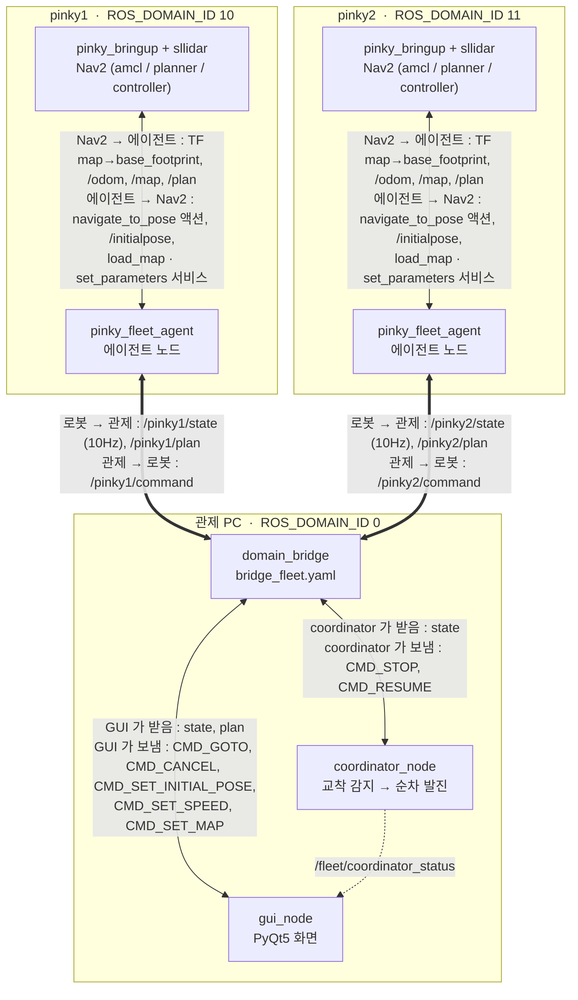
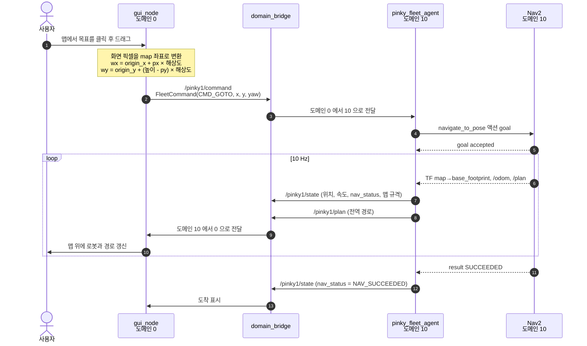
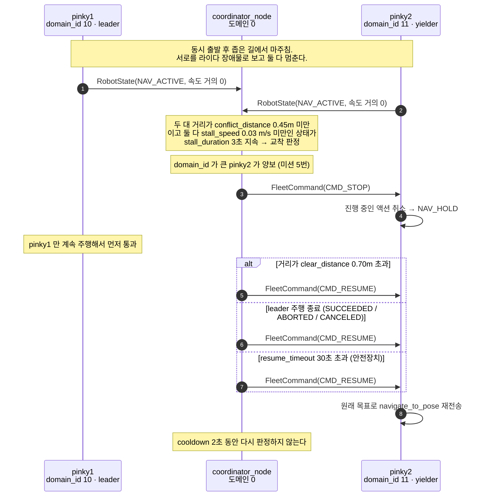

# pinky_pro_team11 — 핑키 프로 2대 멀티로봇 관제

관제 PC 한 대에서 [Pinky Pro](https://github.com/pinklab-art/pinky_pro) 2대를 동시에 제어한다.
GUI 맵 위에 목표를 찍으면 두 대가 동시에 출발하고, 좁은 길에서 서로 막히면
도메인 ID가 작은 쪽이 먼저 통과한 뒤 나머지 한 대가 재출발한다.

**upstream `pinky_pro` 는 한 줄도 수정하지 않는다.** 로봇마다 `ROS_DOMAIN_ID` 를 분리해
namespace / TF frame prefix / `/scan` 충돌 문제를 원천적으로 없앴고, 멀티로봇 로직은
전부 이 저장소의 별도 패키지로 얹었다.

## 미션 요구사항 대응

| 요구사항 | 구현 |
|---|---|
| 1. 핑키가 자신의 위치를 확인 | 로봇의 TF `map → base_footprint` (AMCL) → `RobotState` 로 발행 |
| 2. 각자 가야할 위치를 전달받음 | GUI 클릭 / `mission.yaml` → `FleetCommand(CMD_GOTO)` → 로컬 Nav2 `navigate_to_pose` |
| 3. 동시 출발 | GUI `[동시 출발]` 이 두 로봇에 같은 틱에 `CMD_GOTO` 발행 |
| 4. 만나면 멈춘 후 순차 출발 | 평소엔 Nav2 로컬 플래너 회피. 교착이면 coordinator 가 개입 |
| 5. 도메인 ID 작은 쪽 우선 | coordinator 가 `domain_id` 오름차순으로 leader / yielder 결정 |
| 주의 1. YAML 로 좌표·속도 전달 | `pinky_fleet_station/config/mission.yaml` (GUI 로드·저장, coordinator 가 읽음) |

## 구조

로봇마다 `ROS_DOMAIN_ID` 가 다르다. 관제 PC 의 `domain_bridge` 가 **토픽 3종류**만
도메인 사이로 옮기고, Nav2 액션 / 서비스 / TF 는 전부 로봇 안에서만 쓰인다.



**굵은 선만 도메인을 넘는다.** 액션(`navigate_to_pose`)과 서비스(`load_map`,
`set_parameters`)는 전부 로봇 안에서 끝나고, 도메인 사이로는 토픽만 오간다.

`/tf` `/map` `/scan` `/odom` 은 넘기지 않는다 — 두 로봇의 `odom` / `base_footprint`
프레임 이름이 같아 합치면 충돌하고, 관제 PC 는 map 좌표 숫자만 쓰므로 TF 트리 자체가
필요 없다.

### 왜 에이전트 노드가 필요한가

`domain_bridge` 는 **YAML 설정만으로는 토픽만 브리지할 수 있고 서비스·액션은 브리지하지
못한다.** Nav2 의 `navigate_to_pose` 는 액션이고 속도 변경은 `set_parameters` 서비스다.
또 `domain_bridge` 는 메시지 안의 `frame_id` 를 재작성하지 않는다.

그래서 각 로봇 도메인 안에 경량 에이전트를 두고, 관제 PC 와는 **토픽 3개**(`state` /
`command` / `plan`)로만 대화한다. 액션·서비스·TF 는 전부 로봇 도메인 내부에서만 쓰이므로
관제 PC 에는 TF 트리가 아예 필요 없다.

`plan` 도 같은 이유다. Nav2 는 namespace 를 쓰지 않아 두 로봇이 똑같이 `/plan` 으로
발행하는데, `domain_bridge` 의 `topics` 는 YAML 매핑이라 키가 겹치면 2대를 한 파일에
적을 수 없다. 그래서 에이전트가 도메인을 넘기기 전에 `/<로봇이름>/plan` 으로 이름을 붙인다.

## 패키지

| 패키지 | 설치 대상 | 내용 |
|---|---|---|
| `pinky_fleet_msgs` | 로봇 2대 + 관제 PC | `RobotState`, `FleetCommand` |
| `pinky_fleet_agent` | 로봇 2대 | `agent_node`, `robot.launch.xml`, `nav2_params_fleet.yaml` |
| `pinky_fleet_station` | 관제 PC | `coordinator_node`, `gui_node`, `fake_state_pub`, launch |

`pinky_fleet_msgs` 는 **관제 PC 에도 반드시 빌드·소싱**해야 한다. `domain_bridge` 가
런타임에 메시지 타입서포트를 로드하기 때문이다.

`pinky_fleet_msgs` 의 `.msg` 가 바뀌면 **세 대를 모두 다시 빌드**해야 한다.
한쪽만 갱신하면 타입이 맞지 않아 브리지가 메시지를 넘기지 못한다.

## 설치

세 대 모두 저장소를 받되, **빌드하는 패키지가 다르다.**

저장소는 반드시 colcon 워크스페이스의 `src/` 아래에 둔다. colcon 이 워크스페이스
루트의 `src/` 를 훑어 `package.xml` 을 찾기 때문에, 홈 디렉터리에 그냥 받아두면
빌드되지 않는다. 한 저장소에 세 패키지가 같이 들어 있으므로 **패키지 디렉터리만
따로 옮기지 말고 저장소를 통째로** 넣는다.

**`colcon build` 는 반드시 워크스페이스 루트(`~/pinky_pro`, `~/fleet_ws`)에서 돌린다.**
저장소 디렉터리 안에서 돌리면 `src/pinky_pro_team11/install/` 이라는 워크스페이스가
하나 더 생기고, 그쪽이 `AMENT_PREFIX_PATH` 를 선점해 `git pull` 을 해도 옛 빌드가 계속
쓰인다. 증상이 헷갈린다 — 소스는 최신인데 launch 인자가 예전 것으로 동작한다.
그런 상태라면 이렇게 정리한다.

```bash
rm -rf ~/pinky_pro/src/pinky_pro_team11/{build,install,log}
grep -n "setup.bash" ~/.bashrc          # 중첩 install 을 source 하는 줄이 있으면 삭제
# 새 터미널을 열고 다시 빌드
```

```bash
ros2 pkg prefix pinky_fleet_agent       # ~/pinky_pro/install/... 이어야 정상
```

### 로봇 2대 (SSH, 계정 `pinky`)

기존 `pinky_pro` 워크스페이스를 그대로 쓴다. `pinky_fleet_agent` 의 launch 가
`pinky_bringup` / `pinky_navigation` 을 include 하므로 같은 워크스페이스여야 한다.

```bash
git clone -b mini_project_1 \
    https://github.com/sakim0128/pinky_pro_team11.git ~/pinky_pro/src/pinky_pro_team11
# 이미 홈에 받아 뒀다면:  mv ~/pinky_pro_team11 ~/pinky_pro/src/

cd ~/pinky_pro
colcon build --packages-select pinky_fleet_msgs pinky_fleet_agent
source install/setup.bash
```

`--packages-select` 는 필수다. 빼면 `pinky_pro` 전체와, 로봇에는 필요 없는
`pinky_fleet_station`(PyQt5 의존)까지 다시 빌드한다.

`~/.bashrc` 에 아래를 넣어 두면 접속할 때마다 손이 덜 간다 (핑키 2호는 `11`).

```bash
export ROS_DOMAIN_ID=10
source ~/pinky_pro/install/setup.bash
```

### 관제 PC

`pinky_pro` 가 필요 없으므로 별도 워크스페이스를 만든다.

```bash
sudo apt install ros-jazzy-domain-bridge python3-pyqt5 python3-numpy

mkdir -p ~/fleet_ws/src
git clone -b mini_project_1 \
    https://github.com/sakim0128/pinky_pro_team11.git ~/fleet_ws/src/pinky_pro_team11
# 이미 홈에 받아 뒀다면:  mv ~/pinky_pro_team11 ~/fleet_ws/src/

cd ~/fleet_ws
colcon build --packages-select pinky_fleet_msgs pinky_fleet_station
source install/setup.bash
```

`pinky_fleet_agent` 는 관제 PC 에서 빌드하지 않는다 (`pinky_bringup`,
`pinky_navigation` 의존). 같은 이유로 이 워크스페이스에서 `rosdep install` 을
인자 없이 돌리면 안 된다 — 없는 패키지를 찾다 실패한다.

### 맵 파일

세 대가 **같은 이름의 맵**을 각자 가지고 있는 구조다. 경로는 달라도 된다 —
관제 PC 는 **이름만** 보내고 로봇이 자기 디렉터리에서 찾는다.

```
관제 PC  ~/maps/pinklab.yaml  ──[이름 "pinklab"]──→  핑키  /home/pinky/map/pinklab.yaml
```

**로봇 2대** — 맵 디렉터리는 `/home/pinky/map` 이다 (`map_dir` 인자로 바꿀 수 있다).

```bash
mkdir -p /home/pinky/map
cp ~/pinky_pro/src/pinky_pro/pinky_navigation/map/pinklab.* /home/pinky/map/
```

**관제 PC** — GUI 가 맵 이미지를 로컬 파일에서 직접 로드하므로 사본이 필요하다.

```bash
mkdir -p ~/maps
scp pinky@<핑키1_IP>:/home/pinky/map/pinklab.* ~/maps/
```

그다음 GUI 사이드 패널 `맵` 의 **`[맵 열기]`** 로 복사한 yaml 을 고른다.
`[저장]` 을 누르면 그 경로가 `mission.yaml` 에 기록되어 다음 실행부터 바로 뜬다.
yaml 을 직접 고쳐도 된다 — 아래 파일의 `map.yaml_path`.

```
~/fleet_ws/src/pinky_pro_team11/pinky_fleet_station/config/mission.yaml
```

같은 디렉터리의 `mission_deadlock_test.yaml` 도 마찬가지.

#### 맵을 고르면 로봇의 맵도 바뀐다

`[맵 열기]` 로 맵을 고르면 GUI 가 **맵 이름**을 두 로봇에 자동 전송하고, 각 로봇은
`<map_dir>/<이름>.yaml` 을 찾아 Nav2 의 `map_server/load_map` 으로 교체한다.
경로가 아니라 이름을 보내는 이유는 관제 PC 와 로봇의 맵 디렉터리가 다르기 때문이다.

- **GUI 시작 시 자동 로드에서는 보내지 않는다.** GUI 재시작만으로 주행 중인 로봇의
  맵과 위치 추정이 리셋되면 위험하다. 다시 보내려면 `[로봇에 맵 전송]` 을 누른다.
- 로봇이 이미 같은 이름의 맵을 쓰고 있으면 아무것도 하지 않는다.
- **맵이 바뀌면 AMCL 의 기존 위치 추정이 무효가 된다.** 교체 후 각 로봇의
  `[초기위치 지정]` 을 다시 해야 한다 (GUI 가 안내창을 띄운다).

전송이 제대로 됐는지는 GUI 가 스스로 확인한다. 각 에이전트가 현재 로드한 맵의
**이름**과, `map` 토픽에서 읽은 **규격**(해상도 / 픽셀 크기 / 원점)을 `RobotState` 로
올려보내고, GUI 가 자기 맵과 비교해 다르면 빨간 `맵 불일치` 배너를 띄운다.
로봇에 그 이름의 맵이 없어 교체에 실패하면 여기서 드러난다.

### 네트워크 전제

- 세 대가 같은 서브넷.
- `ROS_AUTOMATIC_DISCOVERY_RANGE` 가 `LOCALHOST` / `OFF` 이면 안 된다 (Jazzy 기본값 `SUBNET` 유지).
- `RMW_IMPLEMENTATION` 이 셋 다 같아야 한다.
- 관제 PC 도메인 `0` 은 ROS 기본값이라 같은 랜의 다른 ROS 프로세스가 섞일 수 있다.
  공용 실습망이면 `pinky_fleet_station/config/bridge_fleet.yaml` 의
  `to_domain: 0` / `from_domain: 0` 을
  다른 값(예: 20)으로 바꾸고 관제 PC 도 같은 값으로 띄운다.

### DDS 인터페이스 고정 (세 대 모두, 최초 1회)

**여분 네트워크 인터페이스가 있으면 세 대가 서로를 발견하지 못한다.** 핑키에는 자체
핫스팟 `ap0`(192.168.4.1)가 기본으로 떠 있고, 관제 PC 에 VPN(`tailscale0` 등)이 있으면
같은 문제가 생긴다.

Fast DDS 는 멀티캐스트로 자기를 알릴 때 모든 인터페이스 주소를 함께 광고하고 상대가
그중 하나로 유니캐스트 응답을 보내는데, 닿지 않는 주소를 고르면 핸드셰이크가 끝나지
않는다. 증상이 고약하다 — `ros2 multicast send` / `receive` 는 양방향으로 잘 통하는데
`ros2 node list` 에는 상대 노드가 하나도 안 보이고 에러도 없다.

```bash
bash scripts/setup_dds_interface.sh          # 기본 경로의 인터페이스를 자동 탐지
bash scripts/setup_dds_interface.sh wlan0    # 직접 지정
```

`~/fastdds_wifi.xml` 을 만들고 `~/.bashrc` 에 `FASTRTPS_DEFAULT_PROFILES_FILE` 을
등록한다. 실행 후 `ros2 daemon stop` 하고 **새 터미널**을 열어야 적용된다.

IP 가 바뀌면(DHCP) 다시 실행해야 하므로, 공유기에서 세 대에 고정 IP 를 주는 편이 낫다.

## 실행

로봇 2대를 먼저 띄운다. `domain_bridge` 는 퍼블리셔가 이미 떠 있을 때 QoS 매칭이 가장 안정적이다.

```bash
# 로봇 pinky1 (SSH)   맵은 /home/pinky/map/pinklab.yaml 이 기본값
export ROS_DOMAIN_ID=10
ros2 launch pinky_fleet_agent robot.launch.xml robot_name:=pinky1 domain_id:=10

# 로봇 pinky2 (SSH)
export ROS_DOMAIN_ID=11
ros2 launch pinky_fleet_agent robot.launch.xml robot_name:=pinky2 domain_id:=11

# 관제 PC
export ROS_DOMAIN_ID=0
ros2 launch pinky_fleet_station fleet.launch.xml \
    mission:=$HOME/fleet_ws/src/pinky_pro_team11/pinky_fleet_station/config/mission.yaml
```

### GUI 조작 순서

1. 맵이 안 보이면 `맵` 패널의 `[맵 열기]` 로 맵 yaml 을 고른다. 라벨에
   `pinklab.yaml · 207x293 px · 0.05 m/px` 처럼 표시되면 정상.
   **로봇에 올린 것과 같은 맵이어야** 좌표가 맞는다. 고르는 순간 이름이 로봇에
   전송되어 로봇의 맵도 바뀐다.
2. 각 로봇 카드의 `[초기위치 지정]` → 맵에서 실제 시작 위치를 **클릭 후 드래그**
   (드래그 방향이 로봇이 바라보는 방향). 위치가 맞게 표시되는지 확인.
3. `[목표 지정]` → 목표를 클릭 후 드래그. (또는 `[불러오기]` 로 `mission.yaml` 적용)
4. 속도를 바꾸려면 `최대 직진 / 최대 회전` 값을 넣고 `[속도 적용]`.
5. `[동시 출발]`.
6. `coordinator [NORMAL/YIELD]` 표시와 두 로봇 사이 거리선으로 개입 상황을 확인.

맵과 목표 좌표를 다음 실행에도 쓰려면 `mission.yaml` 패널의 `[저장]` 을 누른다
(자동 저장하지 않는다). 맵을 SLAM 으로 다시 만들었다면 `[다시 불러오기]`.

실기에서는 **초기 위치를 먼저 잡아야** Nav2 가 움직인다. AMCL 이 로봇 위치를 모르면
목표를 줘도 주행하지 않는다 (로봇 카드에 `위치 미확정` 으로 표시된다).

GUI 상단에 주황색 `시뮬레이션 모드` 배너가 보이면 화면의 로봇이 가짜라는 뜻이다.
GUI 는 `fake_state_pub` 노드가 그래프에 있는지 2초마다 확인해 스스로 켜고 끈다.

맵 조작: 휠 = 확대·축소, 우클릭(또는 가운데 버튼) 드래그 = 이동, `[화면에 맞추기]`.

### 목표를 찍으면 벌어지는 일



화면의 픽셀 좌표는 **GUI 안에서** 맵 yaml 의 `origin` 과 `resolution` 을 써서 map 프레임의
미터 좌표로 바뀐 뒤 전송된다. 로봇에는 이미 변환된 실제 좌표가 도착한다. 그래서 GUI 와
로봇이 **같은 맵**을 써야 값이 맞고, 다르면 빨간 `맵 불일치` 배너가 뜬다.

## 실기 없이 검증하기

> **실제 핑키는 움직이지 않는다.** 화면의 로봇은 `fake_state_pub` 이 지어낸 것이고
> 실기와는 아무 연결이 없다. 이 모드에서는 GUI 상단에 주황색 **`시뮬레이션 모드`**
> 배너가 뜨고 창 제목이 `Pinky Fleet Station — [시뮬레이션 모드]` 로 바뀐다.
> 실기로 돌리려면 이 launch 를 끄고 위의 `fleet.launch.xml` 을 쓴다.

`fake_state_pub` 이 `mission.yaml` 을 읽어 가짜 로봇 2대를 관제 도메인에 직접 띄운다
(브리지·Nav2·하드웨어 불필요). 상대가 주행 중이면 멈추고, 멈춰 있으면 비켜 가는
단순 모델이라 교착 → 양보 → 재출발 전 과정이 그대로 재현된다.

```bash
export ROS_DOMAIN_ID=0
ros2 launch pinky_fleet_station fake_fleet.launch.xml \
    mission:=$HOME/fleet_ws/src/pinky_pro_team11/pinky_fleet_station/config/mission_deadlock_test.yaml \
    auto_start:=True

# 다른 터미널
ros2 topic echo /fleet/coordinator_status
```

`mission.yaml` 의 `state_topic` / `command_topic` 을 노출해 둔 덕분에 coordinator 와
GUI 는 브리지를 쓰든 가짜 로봇을 쓰든 똑같이 동작한다.

단위 테스트:

```bash
cd ~/fleet_ws/src/pinky_pro_team11 && python3 -m pytest pinky_fleet_station/test -q
```

## `pinky_fleet_station/config/mission.yaml`

```yaml
map:
  yaml_path: "..."             # 로봇에 올린 것과 동일한 맵 yaml (GUI 가 직접 로드)

defaults:
  max_linear_vel:  0.20        # m/s   → FollowPath.desired_linear_vel
  max_angular_vel: 1.50        # rad/s → velocity_smoother max_velocity[2]

coordinator:
  conflict_distance: 0.45      # m   이 거리 이내면 "근접"  (1.5 x 2.5m 맵 기준)
  clear_distance:    0.70      # m   이 이상 벌어지면 양보 해제 (히스테리시스)
  stall_speed:       0.03      # m/s 미만이면 "정지"로 간주
  stall_duration:    3.0       # s   근접+정지가 이만큼 지속되면 교착 판정
  resume_timeout:   30.0       # s   양보 대기 최대 시간 (안전장치)
  cooldown:          2.0       # s   해제 직후 재진입 방지
  state_timeout:     2.0       # s   state 가 끊기면 개입하지 않음

robots:
  - name: pinky1
    domain_id: 10              # 작을수록 먼저 출발
    state_topic:   /pinky1/state
    command_topic: /pinky1/command
    color: "#ff5a7a"
    initial_pose: {x: 0.0, y: 0.0, yaw: 0.0}
    goal:         {x: 1.5, y: 2.0, yaw: 0.0}
    max_linear_vel: 0.20       # 생략 시 defaults 사용
```

### 맵 크기에 맞춘 튜닝

`nav2_params_fleet.yaml` 의 값은 **1.5 x 2.5 m 실내 맵**(높이 20cm 하드보드지 벽) 기준으로
조정되어 있다. `# [fleet-tune 1.5x2.5m]` 주석이 붙은 줄이 그 부분이고, 원래 값도 함께
적어 두었다. 더 넓은 공간에서 쓸 때는 이 값들을 키워야 한다.

| 항목 | 값 | 비고 |
|---|---|---|
| `general_goal_checker.xy_goal_tolerance` | 0.08 m | AMCL 오차(2~5cm)가 하한. 진동하면 키운다 |
| `general_goal_checker.yaw_goal_tolerance` | 0.15 rad | 약 9도 |
| `GridBased.tolerance` | 0.10 m | 목표가 막혔을 때 경로를 끊는 거리 |
| `inflation_layer.inflation_radius` | 0.10 m | 내접 반경 0.06 보다 커야 한다 |
| `inflation_layer.cost_scaling_factor` | 5.0 | `FollowPath.inflation_cost_scaling_factor` 와 **같아야 한다** |
| `obstacle_max_range` / `raytrace_max_range` | 1.5 / 2.0 m | 맵 대각선 약 2.9m |
| `local_costmap` 크기 | 2 x 2 m | 맵 전체보다 크면 낭비 |
| `lookahead_dist` (min/max) | 0.25 (0.15/0.4) | 크면 코너를 잘라 벽에 붙는다 |

라이다는 바닥에서 **12.5cm** 높이다 (`base_footprint→base_link` 0.028 +
`→rplidar_mount` 0.067 + `→rplidar_link` 0.030). 20cm 벽은 여유 있게 스캔되지만,
그보다 낮은 장애물은 보이지 않는다.

`conflict_distance` 는 **두 로봇이 실제로 서로 막혀 멈추는 거리보다 커야 한다.**
작게 잡으면 교착이 감지되지 않는다. footprint 12cm 정사각(외접 반경 0.085) + 조정된
`inflation_radius` 0.10m 기준으로 두 로봇의 인플레이션이 겹치기 시작하는 거리가
약 0.37m (2 x 0.085 + 2 x 0.10) 이라 0.45m 을 기본값으로 두었다.
맵 폭이 1.5m 이므로 예전 값 0.70m 은 거의 항상 "근접" 으로 잡혀 쓸 수 없다.

## 교착 회피 동작

평소 회피는 각 로봇의 Nav2 로컬 플래너가 한다 (서로를 라이다 장애물로 인식).
coordinator 는 Nav2 가 스스로 못 빠져나가는 상황만 잡아낸다.



그림에서는 생략했지만 `RobotState` 와 `FleetCommand` 는 모두 `domain_bridge` 를 거친다.
coordinator 는 로봇의 도메인을 직접 알지 못하고 `mission.yaml` 에 적힌 토픽 이름만 쓴다 —
그래서 가짜 로봇(`fake_state_pub`)으로도 이 흐름을 그대로 재현할 수 있다.

상태 정의는 이렇다.

```
NORMAL
  두 로봇 모두 주행 중(NAV_ACTIVE) + 둘 다 정지(|v| < stall_speed)
  + 거리 < conflict_distance  가 stall_duration 동안 지속
      → domain_id 가 큰 쪽에 CMD_STOP, 작은 쪽이 먼저 통과 → YIELD

YIELD
  아래 중 하나면 양보 해제 (CMD_RESUME) → NORMAL (cooldown 동안 재진입 차단)
    · 거리 > clear_distance
    · leader 의 주행이 끝남 (SUCCEEDED / ABORTED / CANCELED)
    · resume_timeout 초과 (안전장치)
```

안전장치 두 겹:
- **coordinator**: 한쪽 `state` 가 `state_timeout` 넘게 끊기면 즉시 `CMD_RESUME` 후 개입 중단.
  오래된 데이터로 멀쩡한 로봇을 세우는 것이 가장 위험하다.
- **에이전트**: HOLD 상태에서 `hold_watchdog`(기본 45초) 동안 아무 명령도 못 받으면
  스스로 HOLD 를 푼다. 관제 PC 나 브리지가 죽어도 로봇이 영원히 서 있지 않는다.

**알려진 한계**: leader 가 좁은 통로 위에서 목표에 도달해 멈춰 버리면 `NAV_ACTIVE` 조건이
깨져 교착 판정이 되지 않는다. 이 경우 yielder 는 Nav2 자체 회피와 recovery behavior 에
의존한다. 두 로봇의 목표를 서로의 경로를 막지 않는 곳에 잡는 것이 전제다.

## upstream `pinky_pro` 와의 관계

코드는 수정하지 않고, `pinky_fleet_agent/params/nav2_params_fleet.yaml` 이
upstream `nav2_params.yaml` 의 사본 + 아래 변경만 담는다 (`[fleet]` 주석으로 표시).
`bringup_launch.xml` 이 `params_file` 을 통째로 한 번만 읽어서 부분 오버레이가 불가능하기 때문이다.

1. `amcl.set_initial_pose` **`true` 를 유지**하고 `initial_pose` 를 nav2 규격
   (`{x: 0.0, y: 0.0, z: 0.0, yaw: 0.0}`)으로 고쳤다. upstream 의 `[0, 0, 0]` 리스트
   형식은 nav2 가 읽지 못한다.
   한때 "초기 위치는 GUI 가 주니까" 라며 `false` 로 바꿨다가 되돌렸다 (`ec88800`).
   AMCL 은 초기 위치를 받기 전까지 `map → odom` TF 를 발행하지 않는데, 그러면
   `global_costmap` 이 변환을 기다리다 타임아웃되어 GUI 가 위치를 보내 볼 기회도 없이
   **Nav2 전체가 기동에 실패한다** (`Failed to bring up all requested nodes`).
2. `controller_server.use_sim_time` 하드코딩 제거 — launch 인자로만 결정.
3. `bt_navigator.robot_base_frame` `base_link` → `base_footprint` — costmap / behavior_server 와 통일.
4. 1.5 x 2.5m 맵에 맞춘 파라미터 조정 — `[fleet-tune 1.5x2.5m]` 주석. 위의
   [맵 크기에 맞춘 튜닝](#맵-크기에-맞춘-튜닝) 참조.

`lifecycle_nodes_nav` 에 `smoother_server` 를 넣는 것은 `robot.launch.xml` 이 인자로 처리한다
(`bringup_launch.xml` 의 기본값이 이를 빠뜨려 `smoother_server` 가 unconfigured 로 방치된다).

도메인 분리 덕분에 아래 upstream 이슈들은 **손댈 필요가 없다**: costmap 의 `topic: /scan`
절대경로, `bringup.py` 의 `odom` / `base_footprint` 하드코딩, `pinky_params.yaml` 의
최상위 키가 `/**` 가 아닌 점 — 전부 로봇마다 도메인이 격리되어 충돌하지 않는다.

## 토픽 / 메시지

| 토픽 | 타입 | 방향 |
|---|---|---|
| `/pinkyN/state` | `pinky_fleet_msgs/msg/RobotState` | 로봇(도메인 N) → 관제(0), 10Hz |
| `/pinkyN/command` | `pinky_fleet_msgs/msg/FleetCommand` | 관제(0) → 로봇(도메인 N) |
| `/pinkyN/plan` | `nav_msgs/msg/Path` | 로봇 → 관제. 에이전트가 Nav2 의 `/plan` 을 이 이름으로 중계한다 (GUI 경로 오버레이) |
| `/fleet/coordinator_status` | `std_msgs/msg/String` (JSON) | coordinator → GUI (도메인 0 내부) |

`FleetCommand.command`: `CMD_GOTO` / `CMD_STOP` / `CMD_RESUME` / `CMD_CANCEL` /
`CMD_SET_INITIAL_POSE` / `CMD_SET_SPEED` / `CMD_SET_MAP`.
`CMD_STOP` 과 `CMD_RESUME` 은 coordinator 만 보내고, 나머지는 GUI 가 보낸다.

`RobotState` 에는 위치·속도·`nav_status` 외에 **그 로봇이 실제로 로드한 맵**
(`map_name`, `map_known`, `map_resolution`, `map_width` / `map_height`,
`map_origin_x` / `map_origin_y`)이 함께 실린다. GUI 가 자기 맵과 비교해 `맵 불일치`
배너를 띄우는 근거다.

`/tf`, `/map`, `/odom`, `/scan` 은 브리지하지 않는다. 두 로봇의 `odom` / `base_footprint`
프레임 이름이 같아 합치면 충돌하고, 관제 PC 는 map frame 스칼라 좌표만 쓰므로 필요가 없다.

Nav2 의 `/plan` 을 브리지 설정에서 직접 remap 하지 않고 에이전트가 중계하는 이유는,
`domain_bridge` 의 `topics` 가 YAML 매핑이라 **키(`/plan`)가 겹치면 로봇 2대를 한 파일에
쓸 수 없기** 때문이다. 이름을 붙이는 일은 도메인을 넘기 전에 로봇 쪽에서 끝낸다.

## 트러블슈팅

| 증상 | 확인 |
|---|---|
| 관제 PC 에서 `/pinky1/state` 가 안 보임 | 로봇에서 `ROS_DOMAIN_ID=10 ros2 topic hz /pinky1/state`. 관제에서 `ROS_DOMAIN_ID=10 ros2 topic list` (브리지 없이도 보여야 정상) |
| 브리지 노드가 시작하자마자 죽음 | 관제 PC 에 `pinky_fleet_msgs` 미설치. `ros2 interface show pinky_fleet_msgs/msg/RobotState` |
| 명령이 로봇에 안 감 | 로봇에서 `ROS_DOMAIN_ID=10 ros2 topic echo /pinky1/command` |
| state 는 오는데 GUI 에 로봇이 안 보임 | `localized` 가 `false` (AMCL 미수렴). 초기 위치를 다시 지정 |
| 로봇이 맵의 엉뚱한 자리에 표시됨 | 두 로봇과 GUI 가 같은 맵 yaml 을 쓰는지 확인 |
| 세 대가 서로를 못 봄 (`ros2 node list` 가 빔) | 여분 인터페이스(`ap0`, `tailscale0` 등) 때문이다. 세 대 모두 `bash scripts/setup_dds_interface.sh` 실행 후 `ros2 daemon stop` + 새 터미널. 위 **DDS 인터페이스 고정** 참조 |
| 로봇 기동 중 `Failed to bring up all requested nodes` | `global_costmap` 이 `map -> base_footprint` 변환을 못 받아 Nav2 가 abort 한 것. AMCL 이 초기 위치를 받기 전까지 `map -> odom` 을 발행하지 않기 때문이다. 이 저장소는 `nav2_params_fleet.yaml` 에서 `set_initial_pose: true` + `initial_pose` 매핑 형식으로 대응한다 — 그 값이 바뀌지 않았는지 확인 |
| 빨간 `맵 불일치` 배너가 뜸 | GUI 가 연 맵과 로봇이 로드한 맵이 다르다. 배너에 어느 로봇의 무엇이 다른지 나온다 |
| 배너에 `맵 이름` 이 다르다고 나옴 | 로봇의 `/home/pinky/map` 에 그 이름의 맵이 없어 교체에 실패했다. 로봇 로그의 `맵 교체 실패` 를 보고 파일을 복사한다 |
| 맵을 바꾼 뒤 로봇이 안 움직임 | 맵이 바뀌면 AMCL 위치 추정이 무효다. 각 로봇의 `[초기위치 지정]` 을 다시 한다 |
| 맵이 같은데 `맵 불일치` 가 뜸 | 맵을 새로 만들고 한쪽만 갱신한 경우다. `ros2 topic echo /pinky1/state --field map_width` 로 로봇이 실제로 쓰는 규격을 확인 |
| 교착인데 coordinator 가 개입하지 않음 | `conflict_distance` 가 실제 멈추는 거리보다 작음. `/fleet/coordinator_status` 의 `distance` 확인 후 키울 것 |
| 불필요하게 자주 멈춤 | `stall_duration` 을 늘리거나 `conflict_distance` 를 줄인다 |
| GUI 에 경로(파란 선)가 안 보임 | 로봇에서 `ROS_DOMAIN_ID=10 ros2 topic hz /pinky1/plan`. 안 나오면 에이전트 빌드가 오래된 것이다 (`/plan` 중계는 나중에 추가됐다). 로봇에서 `ros2 topic hz /plan` 이 나오는지도 확인 |
| 속도 적용이 안 됨 | 로봇에서 `ros2 param get /controller_server FollowPath.desired_linear_vel`. Nav2 가 아직 activate 되기 전이면 건너뛴다 (로그 확인) |
