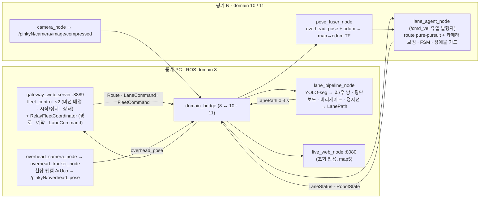

# pinky_pro_team11 — 핑키 2대 비전 차선 주행 · 중계 관제 · 교차로 선착순

[Pinky Pro](https://github.com/pinklab-art/pinky_pro) **2대**가 마스킹 테이프 도로망 위에서 각자 시작점 → 목적지로 간다.
로봇은 **카메라 세그멘테이션(왼쪽·오른쪽 차선)의 중점**을 따라 달리고, 천장 카메라(항공뷰 ArUco)가 준 **맵 위 위치**로
도로망 경로(어느 길로)를 따른다. 교차로는 **정지선**을 보면 일단 서고, 관제가 **먼저 도착한 로봇**에게 통과를 허가한다.
시작점·목적지는 관제 PC yaml 이 아니라 **웹(relay :8889)** 에서 고른다.

> 이 문서는 통합 브랜치(`mini_project_integration` → 작업 브랜치 `mini_project_integration_stand`, 2026-09-29) 기준이다.
> 결정·변경 이력은 [`docs/integration/status.md`](docs/integration/status.md), mini_project_1(Nav2 2대 관제)은 [`docs/mini_project_1.md`](docs/mini_project_1.md).

---

## 과제 요구사항 ([`MVP_subject.html`](MVP_subject.html)) ↔ 구현

| # | 요구 | 구현 |
|---|---|---|
| 1 | **차선 추종** | YOLO-seg `left_lane`/`right_lane` → 샘플 행에서 좌/우 x → 중점 (차선 ≥ 3 이면 클래스 기준 가장 바깥 쌍) |
| 2 | **중앙 정렬** | `error_x = (target_x − W/2)/(W/2)` 를 각속도 보정항으로, 20 Hz. 좌우 위치는 100 % 카메라 |
| 3 | **횡단보도 정지** 후 재주행 | `crosswalk` 하단 y ≥ 0.8·H, 3 프레임 확정 → 3 s 정지 → 0.6 m 재래치 방지 |
| 4 | **장애물 정지**, 제거 시 **자동 재개** | 라이다 전방 섹터 + 초음파 → 1 s 비면 복귀. `barricade` 클래스도 정지 트리거 |
| + | 시작·목적지 지정, **2대 동시**, **교차로** | 웹 배정 → 도로망 경로 + 구간 예약(선착순) + 정지선 `JUNCTION_STOP` → 허가 뒤 통과 |

---

## 아키텍처 (2026-09-29 결정: 코디네이터·웹·도로망·지도·로봇 이름 각 하나)


```mermaid
flowchart LR
    subgraph PC["중계 PC · ROS domain 8"]
        GW["gateway_web_server :8889<br/>fleet_control_v2 (미션 배정 · 시작/정지 · 상태)<br/>+ RelayFleetCoordinator (경로 · 예약 · LaneCommand)"]
        LP["lane_pipeline_node<br/>YOLO-seg → 좌/우 쌍 · 횡단보도 · 바리게이트 · 정지선 → LanePath"]
        OC["overhead_camera_node → overhead_tracker_node<br/>천장 웹캠 ArUco → /pinkyN/overhead_pose"]
        LW["live_web_node :8080<br/>(조회 전용, map5)"]
        B["domain_bridge (8 ↔ 10 · 11)"]
    end
    subgraph R["핑키 N · domain 10 / 11"]
        CAM["camera_node → /pinkyN/camera/image/compressed"]
        PF["pose_fuser_node<br/>overhead_pose + odom → map→odom TF"]
        LA["lane_agent_node (/cmd_vel 유일 발행자)<br/>route pure-pursuit + 카메라 보정 · FSM · 장애물 가드"]
    end
    GW -->|Route · LaneCommand · FleetCommand| B --> LA
    LP -->|LanePath 0.3 s| B
    OC -->|overhead_pose| B --> PF --> LA
    CAM --> B --> LP
    LA -->|LaneStatus · RobotState| B --> GW
    B --> LW
```

### 원칙
1. `/cmd_vel` 발행자는 로봇의 `lane_agent_node` 하나. Nav2 planner/controller 는 쓰지 않는다 (Nav2 하이브리드 스택은 삭제).
2. **정지 권한은 로봇.** 관제는 "가도 되는 지점"(`clear_until`)과 "무엇이 보이는지"(LanePath)만 준다. 관제가 죽으면 `link_watch` 로 멈춘다.
3. 위치는 항공뷰. 마커가 3 s 안 보이면 TF 를 끊어 로봇이 선다 (odom 만 믿고 오래 달리지 않는다).
4. 이름은 `pinky1`·`pinky2` 하나. 토픽은 `/pinkyN/...`, 관제 도메인 8, 로봇 10·11.

---

## 주행 규칙 (로봇 `lane_agent_node` · ROS-free `lane_driver`/`drive_fsm`)

우선순위: `ESTOP > LINK_LOST > OBSTACLE_WAIT > BARRICADE_WAIT > WAIT_CLEARANCE > CROSSWALK_STOP > CROSSWALK_CLEAR > JUNCTION_STOP > JUNCTION_PASS > ARRIVED > LANE_SEARCH > LANE_LOST > CRUISE > IDLE`

```
P   = Route lookahead(0.25 m) 점 → 로봇 좌표
ω_route = 2·v·sin(atan2(P.y, P.x)) / L_d                 # pure pursuit (어느 길로)
ω_cam   = −(Kp·error_x + Kd·Δerror_x/Δt)                  # 차선 중앙 (그 길의 어디에)
ω = ω_route + w_cam·ω_cam,   w_cam = BOTH 1.0 · SINGLE 0.5 · JUNCTION/LOST/STALE 0
v = v_max · min(1, 1 − k·|error_x|, 1 − k'·|ω|/ω_max),   clear_until 앞에서 감속·정지
```

- **차선 쌍**: ≤ 2개면 화면 중앙에 가장 가까운 좌/우, ≥ 3개면 모델 클래스 기준 가장 바깥 쌍.
- **차선 하나**: 회전하지 않고 보이는 선에서 안쪽으로 반폭 × 0.8(도로 15 cm → 6 cm) 떨어진 점을 따라간다. 좌/우는 모델 클래스
  (`left_lane`/`right_lane`)로 정하고 클래스가 없을 때만 화면 위치. 카메라 보정 가중치 0.8 (`control.single_weight`).
  설정: `detector_yolo.yaml` `target.single_offset_ratio`·`single_use_class`, `lane_agent.yaml` `fsm.search_on_single: false`.
- **차선 없음**: 0.5 s 안 보이면 `LANE_SEARCH`(제자리 회전 0.4 rad/s, 8 s 넘기면 정지).
- **횡단보도**: 3 s 정지 → 통과, 재래치는 주행거리 0.6 m. 그래프 crosswalk 노드 반경 밖 트리거는 무시.
- **장애물**: 라이다(±35°, 0.18 m) 또는 초음파 ≤ 0.20 m, 2 연속 → 정지, 1 s 비면 자동 복귀. **바리게이트**: 카메라 확정 → 정지, 1 s 안 보이면 재출발.
- **교차로 (정지선 · 선착순)**:

```
로봇  정지선(LanePath.stop_line_detected, 경로상 다음 분기 노드 ≤ stop_line_zone 0.6 m) 또는 분기 반경 0.25 m → JUNCTION_STOP (v=0)
      → LaneStatus drive_state=12 보고
관제  JUNCTION_STOP 보고 → 거리와 무관하게 다음 엣지 요청 등록 (reservation.request_next_now)
      → 예약이 선착순(요청 틱, 같은 틱이면 domain_id 작은 쪽) 으로 분기 노드 + 다음 엣지를 한 로봇에만 → CLEARANCE(clear_until > 분기 idx)
로봇  1 s 지났고 허가 있음 → JUNCTION_PASS (카메라 끄고 경로만, v_max×0.4) → 차선 쌍 0.3 s 보이면 CRUISE.  허가 없음 → "교차로 대기" 로 계속 정지
관제  통과한 로봇이 노드를 0.25 m 지나면 놓는다 → 다음 로봇 허가
```

  정지선은 분기 노드 **0.1 m 이내** 앞에 붙인다. 정지선 클래스는 **아직 모델에 없다** — `pinky_lane_station/config/detector_yolo.yaml` 의
  `# stop_line: [<id>]` 를 재학습 뒤 채운다. 그 전엔 분기 반경(항공뷰 위치) 트리거만 동작한다. lane_only 모드는 정지선만으로 1 s 정지 뒤 통과.
  파라미터: `stop_line_zone`, `junction_wait_clearance`(false 면 예전처럼 1 s 뒤 통과), `fsm.junction_stop_seconds` (`pinky_fleet_agent/params/lane_agent.yaml`).

---

## 비전 미션 모드 (2026-09-30) — 위치추정 없이 카메라로 달리고 교차로만 고정 동작

항공뷰 없이 돈다. 코스: T자 교차로 하나, 1번(오른쪽 위 끝) · 2번(왼쪽 아래) · 3번(아래 가운데, 교차로 오른쪽 가지).

| 시나리오 | 로봇 | 경로 | 교차로 동작 (임시값) | 출발 | 도착 정지선 |
|---|---|---|---|---|---|
| s1 (교차로에서 만남) | pinky1 | 2 → 1 | 직진 0.35 m | 0 s | 통행권 순서로: 먼저 지난 로봇 2번째(앞), 나중 1번째(뒤) |
| s1 | pinky2 | 3 → 1 | 직진 0.18 → 우회전 90° → 직진 0.10 | 0 s | 〃 |
| s2 (순차 출발) | pinky1 | 1 → 2 | 직진 0.35 m | 0 s | 1번째 |
| s2 | pinky2 | 1 → 3 | 직진 0.18 → 좌회전 90° → 직진 0.10 | 10 s | 1번째 |

```
로봇  차선 주행(카메라) → 빨간 테이프(YOLO red_line, 화면 하단 0.80·H) 앞 JUNCTION_STOP (1 s + 관제 허가 대기)
관제  교차로 통행권 하나: 먼저 정지를 보고한 로봇 먼저, 0.5 s 안이면 domain_id 작은 쪽(pinky1=10)
로봇  허가(CLEARANCE 1) → 고정 동작(odom, 장애물에 끊기면 남은 양만 이어서) → 차선 쌍이 보이면 주행, 안 보이면 방금 돈 쪽으로 탐색 회전
관제  통행권 쥔 로봇이 차선 주행(교차로 뒤 CRUISE)으로 돌아간 순간 반납 → 다음 로봇 허가
로봇  교차로 뒤 흰 정지선(영상 처리)을 N 번째 만나면 그 앞에서 도착. 출발 지점 정지선은 교차로 전이라 세지 않는다
로봇  교차로를 지난 뒤 빨간 선(출구)도 RED_LINE_STOP 1 s 정지 후 출발. 고정 동작 중에 본 선은 동작이 끝나자마자 선다
공통  장애물(라이다 상자 0.18 m = 앞면 8 cm + 10 cm, 초음파 0.10 m) 에서 정지, 치워지면 1 s 뒤 재출발
      시나리오 없이 테스트 주행(lane_only): 빨간 선을 볼 때마다 RED_LINE_STOP 1 s 정지 후 출발 (허가 불필요)
```

- 빨간 선 판정: 검출이 꺼졌다 켜지는 순간(상승 에지)마다 한 번 선다. 서 있는 동안 같은 선이 계속 보여도 다시 서지 않고,
  정지 뒤 `red_line_min_gap`(5 cm) 을 달린 다음의 선만 새 선으로 본다. 입구·출구 선이 가까워도 둘 다 선다.
  설정 `lane_agent.yaml` `fsm.red_line_stop` · `fsm.red_line_stop_seconds` · `red_line_min_gap`.
- 차선 조향: D 항은 새 LanePath 가 올 때만 측정 간격으로 계산하고, error 는 새 측정마다 저역통과(`control.error_alpha` 0.5)한다.
  제어 20 Hz · 인식 ≤ 10 Hz 차이 때문에 프레임마다 조향이 튀던 것을 없앤다.
- 인식 주기 확인: 로봇 `ros2 topic hz /pinky1/lane_path` (설계 10 Hz), 관제 `ros2 topic echo /pinky1/scene_state --field infer_ms`,
  로봇 `ros2 topic echo /pinky1/lane_status --field path_age` (이미지 촬영 → 로봇 수신 지연).

- 설정: 교차로 동작·시나리오 `pinky_lane_station/config/vision_mission.yaml`(관제), 흰 정지선 임계값 `detector_yolo.yaml` 의 `stop_line:`,
  빨간 테이프는 모델 클래스 이름 `red_line`(`class_map`), 로봇 튜닝 `lane_agent.yaml`(`maneuver:` · `guard.us_stop` · `stop_line_min_gap`).
- 현장 준비: 1번 지점 흰 정지선 두 개(간격 30 cm 이상), 2·3번에 하나씩. 로봇은 각 출발 지점에 차선 방향으로.

```bash
# 관제 PC (도메인 0 예) — 브리지 + 인식, 그리고 게이트웨이를 비전 모드로
ros2 launch pinky_lane_station lane_station.launch.xml pinky1_domain:=10 pinky2_domain:=11
python3 relay_station/gateway_web/gateway_web_server.py --port 8889 --map-yaml pinky_fleet_station/config/map5.yaml --no-camera --vision
# 핑키 (각각) — lane_only, auto_start 없이 (관제가 계획·START 를 준다)
ros2 launch pinky_fleet_agent lane_only.launch.xml robot_name:=pinky1 domain_id:=10 v_max:=0.15
# 웹 http://<관제 PC>:8889/fleet_control_v2.html → 대시보드 "시나리오 1 시작" / "시나리오 2 시작" · 일시정지 · 재시작 · 비상정지
```

실물 없이 도커로 돌려 보기(시나리오 폐루프 · 태블릿 가상 카메라 · 게이트웨이 `--vision`): [`docs/integration/mock_test.md`](docs/integration/mock_test.md).

로봇 둘(핑키1 팀 방식 · 핑키2 Nav2)을 도커로 두고 실제 중계 · 태블릿에 녹화 영상을 먹이는 시험 시나리오: [`docs/integration/mixed_fleet_test.md`](docs/integration/mixed_fleet_test.md).

현장 조정 순서: 로봇 1대로 경로마다 교차로 동작 값 재기(`vision_mission.yaml` 고치고 게이트웨이만 재시작) → 시나리오 2 → 시나리오 1.
인식 확인은 `python3 tools/view_image.py /pinky1/lane_debug/compressed` (상단 글자 `red=` `stop=`, 흰 정지선은 분홍 상자).

---

## 운영 (웹에서 시작점·목적지 → 출발)

브라우저 `http://<중계 PC>:8889/fleet_control_v2.html`

1. **설정 탭 → "미션 배정"**: 로봇마다 시작/목적지(도로망 endpoint 노드 드롭다운) → **배정**. 같은 목적지, 다른 로봇 경로 안의 목적지는 서버가 거절(409).
   API: `POST /api/fleet/assign {"robot":"pinky1","start":"BL","goal":"TR"}`. 목록은 `GET /api/fleet/profiles` 의 `graph.endpoints`.
2. **③ 초기 위치 보내기** (출발 노드를 `CMD_SET_INITIAL_POSE` 로) — 항공뷰가 살아 있으면 pose_fuser 가 곧 덮어쓴다.
3. **주행 시작** (`/api/fleet/start`). 일시정지 `stop` · 재개 `resume` · 비상정지 `estop` · 로봇별 `/api/pinkyN/stop|resume`.
4. 대시보드 카드: `BL→TR`, drive_state(교차로 정지/통과 포함), 예약 `waiting_for`/`blocked_by`, `junction_wait_sec`.

움직이는 명령은 중계 PC 자신 또는 `relay_station/configs/control_allow.json` 에 허용된 노트북 한 사람만 낸다 ([`docs/integration/control_policy.md`](docs/integration/control_policy.md)).

---

## 지도 · 도로망

- 운영 지도는 **map5** (`pinky_fleet_station/config/map5.yaml` + `config/maps/map5.pgm`, 236×128 셀, 0.01 m, 원점 [−0.01, −0.01] → x 0..2.36 m, y 0..1.28 m).
- 도로망 정본은 **`pinky_lane_station/config/road_graph.yaml` 하나**. 중계 프로파일(`relay_station/fleet/config/profiles/team11_map5`)이 상대경로로 읽는다.
  지금 좌표는 **임시**(BL 왼쪽 하단 · BR 오른쪽 하단 · TR 오른쪽 상단 · J 교차로) — 새 맵 위에서 `graph_editor` 로 다시 찍는다.
- 편집: `ros2 run pinky_lane_station graph_editor -- --map pinky_fleet_station/config/map5.yaml --graph pinky_lane_station/config/road_graph.yaml`
  (또는 텔레옵 주행 기록 `record_graph`). 시작·목적지 후보 = `type: endpoint` 노드, 교차로 = `type: junction`.

---

## 메시지 (`pinky_lane_msgs` · `pinky_fleet_msgs`)

| 메시지 | 방향 | 핵심 필드 |
|---|---|---|
| `Route` | 관제→로봇 (TRANSIENT_LOCAL) | waypoints[] · edge_end_idx[] · edge_ids[] · goal_idx · crosswalk_idx[] · junction_idx[] |
| `LanePath` | 관제→로봇 (BEST_EFFORT/1) | quality(BOTH/SINGLE/JUNCTION/STALE/LOST) · error_x_norm · left/right_seen · crosswalk_detected · barricade_detected · **stop_line_detected** |
| `LaneCommand` | 관제→로봇 (RELIABLE/10, 10 Hz) | HEARTBEAT/START/STOP/ESTOP/RESUME/SET_SPEED/CLEARANCE · route_seq · clear_until_idx |
| `LaneStatus` | 로봇→관제 (10 Hz) | drive_state 0~13 (12 JUNCTION_STOP · 13 JUNCTION_PASS) · state_reason · route_idx · clear_until_idx · lane_quality |
| `SceneState` | 관제 내부 | crosswalk/barricade/stop_line raw·detected·bottom_y·conf · lane_count · pair_rule · infer_ms |
| `RobotState` / `FleetCommand` | 로봇↔관제 | pose · localized · domain_id · SET_INITIAL_POSE · SET_SPEED · SET_MAP |

메시지가 바뀌면 **관제 PC·핑키 모두 `pinky_lane_msgs` 재빌드**.

---

## 패키지

| 위치 | 역할 |
|---|---|
| `pinky_fleet_agent/` (로봇) | `lane_agent_node`(주행, `/cmd_vel`) · `camera_node` · `pose_fuser_node`(항공뷰 → TF) · ROS-free `lane_driver` `drive_fsm` `lane_control` `route_follower` `obstacle_guard` `link_watch` · `launch/lane_robot.launch.xml` `lane_only.launch.xml` · `params/lane_agent.yaml` (튜닝값은 여기 한 곳) |
| `pinky_lane_station/` (관제) | `lane_pipeline_node`(인식) · ROS-free `lane_target` `road_graph` `detectors/{ultralytics_backend,classic,stub}` · `graph_editor` `record_graph` `bench_detector` `fake_lane_robot` · `config/{road_graph,lane_mission,detector_yolo,detector_lane}.yaml` `bridge_pinkyN_{up,down}.yaml`(도메인은 launch 인수) · `launch/lane_station.launch.xml`(브리지 + 인식) `fake_lane.launch.xml` |
| `relay_station/` (관제, colcon 밖) | `gateway_web/gateway_web_server.py`(:8889 웹 · 코디네이터 호스트 · 영상 중계) · `fleet/{fleet_coordinator,reservation,profiles}.py` · `domain_bridge/`(8↔10·11 설정·생성기·systemd) · `configs/`(DDS · 제어권 허용) — [`relay_station/README.md`](relay_station/README.md), [`docs/integration/relay_station.md`](docs/integration/relay_station.md) |
| `pinky_fleet_station/` (관제) | `overhead_camera_node` + `overhead_tracker_node`(항공뷰 ArUco → `/pinkyN/overhead_pose`, [`docs/integration/overhead_tracker.md`](docs/integration/overhead_tracker.md)) · `live_web_node`(:8080 조회, [`docs/integration/live_web.md`](docs/integration/live_web.md)) · `config/map5.*` · mini_project_1 의 Nav2 관제(`gui_node` `coordinator_node` `agent_node`)는 이력용 |
| `pinky_lane_msgs/` `pinky_fleet_msgs/` | 위 메시지 |
| `tools/` | 데이터 수집 `record_drive.py` `extract_frames.py` · 블랙박스 `collect_logs.sh` `bag_report.py` · 항공뷰 캘리브레이션 `overhead_calib.py` |

---

## 실행

| | 체크아웃 | 워크스페이스 | 도메인 | 빌드 |
|---|---|---|---|---|
| 관제(중계) PC | `~/fleet_ws/src/pinky_pro_team11` | `~/fleet_ws` | 8 | `pinky_fleet_msgs pinky_lane_msgs pinky_fleet_agent pinky_lane_station pinky_fleet_station` |
| 핑키 (`pinky@192.168.4.1`) | `/home/pinky/pinky_pro/src/pinky_pro_team11` | `~/pinky_pro` | 10 (pinky2 는 11) | `pinky_fleet_msgs pinky_lane_msgs pinky_fleet_agent` |

```bash
# 공통
cd <워크스페이스> && colcon build --packages-select <빌드 패키지> && source install/setup.bash

# 관제 PC (도메인 8, ~/fleet_ws) — 순서대로. relay 스크립트는 체크아웃을 ~/pinky_pro/src/pinky_pro_team11 로 가정하므로
# 다른 경로면 REPO_ROOT=~/fleet_ws/src/pinky_pro_team11 를 주거나 아래처럼 직접 띄운다
export ROS_DOMAIN_ID=8
ros2 run domain_bridge domain_bridge relay_station/domain_bridge/configs/pinky1_control.yaml &   # 브리지 8↔10
ros2 run domain_bridge domain_bridge relay_station/domain_bridge/configs/pinky2_control.yaml &   # 브리지 8↔11
python3 relay_station/gateway_web/gateway_web_server.py --port 8889 --map-yaml pinky_fleet_station/config/map5.yaml --no-camera   # 웹 :8889 (코디네이터 포함)
#   (relay_station/launch_master_gateway.sh 는 위 셋을 CycloneDDS 로 한 번에 띄운다 — 핑키도 Cyclone 일 때만)
ROS_DOMAIN_ID=8 ros2 launch pinky_lane_station lane_station.launch.xml use_bridge:=False    # 차선 인식 (브리지는 위가 나른다)
#   relay 브리지 대신 팀11 브리지로 갈 때(관제 0 · 로봇 45/46 등): 도메인은 인수다 — yaml 을 고치지 않는다
#   ROS_DOMAIN_ID=0 ros2 launch pinky_lane_station lane_station.launch.xml pinky1_domain:=45 pinky2_domain:=46
ROS_DOMAIN_ID=8 ros2 launch pinky_fleet_station overhead_tracker.launch.xml camera_device:=0 # 천장 웹캠 + ArUco → overhead_pose
ROS_DOMAIN_ID=8 ros2 launch pinky_fleet_station live_web.launch.xml                          # (선택) 조회 웹 :8080
ros2 run rqt_image_view rqt_image_view /pinky1/lane_debug/compressed                         # 원본 + bbox + 차선 중심점

# 핑키 (각 로봇)
export ROS_DOMAIN_ID=10   # pinky2 는 11
ros2 launch pinky_fleet_agent lane_robot.launch.xml robot_name:=pinky1 domain_id:=10 map:=$HOME/map/map5.yaml camera_orient:=rot180
#   use_overhead:=True(기본) 항공뷰 pose_fuser · marker_yaw_offset / marker_offset_x 로 마커 부착 보정 · use_amcl:=True 면 AMCL

# 차선만 추종 테스트 (경로·위치추정 없이)
ros2 launch pinky_fleet_agent lane_only.launch.xml robot_name:=pinky1 domain_id:=10 auto_start:=True v_max:=0.10

# 테스트 (ROS 불필요)
python3 -m pytest pinky_lane_station/test pinky_fleet_agent/test pinky_fleet_station/test -q
cd relay_station && python3 -m pytest tests -q          # rclpy 가 있어야 전부 돈다
```

인식 모델: `~/models/lane_26n.pt` (git 밖), 클래스 0 왼쪽 라인 · 1 횡단보도 · 2 오른쪽 라인 · 3 라바콘 · 4 신호등 · 5 바리게이트 (정지선은 미정).
추론 입력은 상위 50 % 를 마스킹한다(`pipeline.mask_top_frac: 0.50`, 2026-09-30 — 모델 학습은 30 % 마스킹). 벤치: `python3 -m pinky_lane_station.bench_detector --config pinky_lane_station/config/detector_yolo.yaml --synthetic`.

---

## 미결 · 확인이 필요한 것

- **정지선 클래스**: 차선 세그 vs 주행가능영역 세그 미결 → 재학습 뒤 `detector_yolo.yaml` `stop_line: [<id>]`.
- **새 맵**: map5 규격으로 다시 저장하고 `road_graph.yaml` 좌표를 편집기로 다시 찍는다(지금은 임시 4노드).
- **DDS 통일**: Fast DDS(기본)로 통일 완료. 5GHz 공유기 재배치로 멀티캐스트 안정화되어 CycloneDDS 사용을 배제하고 팀11 기본 RMW(rmw_fastrtps_cpp)로 일치시킴.
- **항공뷰 캘리브레이션**: `tools/overhead_calib.py` 로 map5 좌표 호모그래피를 `overhead_tracker.yaml` 에 기록. 마커 id (로봇 1/2, 꼭짓점 40~43) 확정.
- **rclpy 시험 재측정**: relay 시험 중 rclpy/ROS msgs 가 필요한 것은 이번 정리에서 컴파일만 했다 — 중계 PC 에서 `cd relay_station && pytest tests -q`.
- **live 웹(:8080)** 은 조회 전용으로 남겼다 — 둘 중 하나를 지울지는 나중에.
- 데이터 수집·블랙박스 절차는 [`tools/README.md`](tools/README.md).
