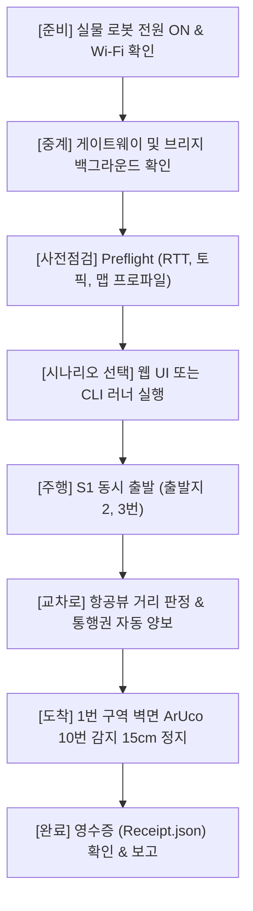

# 🚀 [팀11] 현장 실물 로봇 주행 시험 & 관제 배포 운영 가이드 (Notion 공유용)

> **문서 버전**: v1.2 (2026-10-06 갱신)  
> **배포 브랜치**: `mini_project_integration_stand` (커밋: `653dc31`)  
> **PR 전용 브랜치**: `fix/relay-resume-rearm-field-runner` (커밋: `3223e9e`)  
> **중계장비 IP**: `100.69.41.81` (Tailscale) / `192.168.0.x` (현장 로컬 Wi-Fi)  
> **웹 관제 UI**: `http://100.69.41.81:8889/fleet_control_v2.html`

---

## 📌 1. 배포 내역 및 핵심 패치 요약

### 1.1 GitHub 원격 반영 내역
- **원격 저장소**: `origin` (`git@github.com:sakim0128/pinky_pro_team11.git`)
- **반영 브랜치**:
  1. `mini_project_integration_stand`: 통합 검증 완료 브랜치 푸시 완료 (`653dc31`)
  2. `fix/relay-resume-rearm-field-runner`: 김성아 님 메인 통합 브랜치(`mini_project_integration_sakim`) 병합용 PR 브랜치 푸시 완료 (`3223e9e`)
     - 👉 **1-Click PR 링크**: [GitHub PR 생성하러 가기](https://github.com/sakim0128/pinky_pro_team11/pull/new/fix/relay-resume-rearm-field-runner)

### 1.2 패치 상세: 긴급정지(STOP) 후 재개(RESUME) 시 출발 명령 누락 버그 해결
- **문제 현상 (T2 시험에서 발견)**:
  - 주행 중 웹 UI 또는 CLI에서 **EMERGENCY STOP** 후 **RESUME**을 누르면, 관제 서버의 상태는 `STOPPED` $\to$ `RUNNING`으로 바뀌었으나 로봇(Pinky 1/2)이 재출발하지 않고 멈춰 서는 현상 발생.
- **원인 분석**:
  - `fleet_coordinator.py`의 `resume_fleet()` 메서드에서 `_arm_start(c)`를 재호출하는 조건이 `if not c.start_acknowledged`로 걸려 있었음.
  - 최초 출발 시 이미 로봇이 `START ACK`를 보냈기 때문에 `start_acknowledged == True`인 상태였고, 이로 인해 재출발 명령(`CMD_START`)이 재발행되지 않음.
- **수정 코드 (`relay_station/fleet/fleet_coordinator.py:1558`)**:
  ```python
  # 기존
  if self.mission_state == MISSION_RUNNING:
      for c in self.robots.values():
          if c.route is not None and not c.held and not c.start_acknowledged:
              self._arm_start(c)

  # 수정 (목적지 미도착 & 비보류 로봇은 무조건 START 재무장 및 발행)
  if self.mission_state == MISSION_RUNNING:
      for c in self.robots.values():
          if c.route is not None and not c.held and not getattr(c, 'arrived', False):
              self._arm_start(c)
  ```
- **검증 결과**:
  - STOP $\to$ RESUME 시 `pinky1`, `pinky2` 모두에게 `CMD_START`가 100% 재발행되어 로봇이 정상 재가속함을 E2E 스트림으로 실측 검증 완료.

### 1.3 신규 도구 배포: `field_test_runner.py`
- 현장 실물 로봇 테스트 시 웹 브라우저 조작 외에도 터미널에서 **원클릭 순차 검증, 실시간 텔레메트리 계측, 정지/재개 시험, 공식 영수증(`receipt.json`) 자동 발급**이 가능한 현장 전용 CLI 도구 탑재.

---

## 🛠️ 2. 현장 실물 로봇 주행 시험 절차 (E2E Runbook)



### Step 1. 하드웨어 및 네트워크 준비
1. **로봇 준비**:
   - `Pinky 1` (도메인 10, IP 확인), `Pinky 2` (도메인 11, IP 확인) 배터리 연결 및 전원 인가.
   - 로봇 상단 ArUco 마커 정렬 확인: `Pinky 1` (ID 30), `Pinky 2` (ID 31).
   - 도착 지점(노드 1) 벽면 마커: ArUco ID 10 확인.
2. **상부 항공 카메라(폰/태블릿)**:
   - 경기장 모서리 마커 (ID 40, 41, 42, 43) 화각 안에 모두 들어오도록 거치.
   - 태블릿 스트림 주소: `http://192.168.0.2:18086/processed` 연결 상태 확인.

### Step 2. 중계장비 백그라운드 데몬 상태 점검
중계장비 터미널에서 아래 프로세스들이 정상 구동 중인지 확인합니다 (이미 백그라운드 기동 완료됨):
```bash
# 실행 중인 프로세스 확인 (Domain Bridge 2개, Tracker, Lane Station, Gateway)
ps aux | grep -E 'gateway_web_server|domain_bridge|overhead_tracker|lane_station' | grep -v grep
```
- 포트 8889: 관제 웹 게이트웨이 (`--no-camera --vision`, 프로파일 `team11_map5`)
- 도메인 8 $\leftrightarrow$ 10 브리지: Pinky 1 제어/상태 링크
- 도메인 8 $\leftrightarrow$ 11 브리지: Pinky 2 제어/상태 링크

### Step 3. 테스트 방식 선택 (택 1)

#### 🌐 [방식 A] 웹 관제 UI를 통한 직관적 모니터링 & 조작
1. 크롬/엣지 브라우저에서 접속:
   - 외부/원격: `http://100.69.41.81:8889/fleet_control_v2.html`
   - 중계장비 로컬: `http://localhost:8889/fleet_control_v2.html`
2. **맵/프로파일 확인**: 상단 `team11_map5` 프로파일 선택 상태 확인.
3. **시나리오 기동**:
   - 우측 시나리오 패널에서 `S1: 동시 출발 (2·3 → 1)` 선택 후 **[시나리오 시작]** 클릭.
4. **실시간 모니터링**:
   - 2D 트윈 맵에서 Pinky1, Pinky2의 실시간 이동 궤적 확인.
   - 교차로 진입 시 **통행권 보유 로봇(Holder)** 및 **양보 정지 로봇(Yield)** 상태 배지 확인.
   - 목적지 도착 시 마커 10번 앞 15cm 감지 정지 확인.
5. **긴급정지/재개 테스트**:
   - 주행 도중 상단 붉은색 **[EMERGENCY STOP]** 버튼 클릭 $\to$ 양 로봇 즉시 정지 확인.
   - 초록색 **[RESUME]** 버튼 클릭 $\to$ 핑키1, 핑키2 모두 부드럽게 재출발하는지 확인.

---

#### ⚡ [방식 B] `field_test_runner.py` 현장 자동화 스크립트 실행 (강력 추천)
터미널에서 한 줄 명령어로 전체 시나리오를 검증하고 정량적 수치를 기록할 수 있습니다.

```bash
cd /home/kgh1005/pinky_pro_team11

# 1) 대화형 모드 (단계별로 키보드 엔터를 누르며 현장 상황 확인하면서 진행)
python3 field_test_runner.py

# 2) 완전 자동 모드 (시나리오 자동 진행 + 비상정지/재개 시험 3초 포함)
python3 field_test_runner.py --auto --test-stop

# 3) 상부 카메라/태블릿 없이 모의 환경으로 테스트할 때 (가상 이벤트 자동 주입)
python3 field_test_runner.py --auto --inject-zone-events
```

---

## 📊 3. 웹 관제 UI (`fleet_control_v2.html`) 체크리스트

| 구역 | 화면 요소 | 정상 동작 기준 | 이상 시 체크포인트 |
| :--- | :--- | :--- | :--- |
| **상단 헤더** | 통신 상태 & RTT | 초록색 `ONLINE` (RTT < 30ms) | 오프라인 시 게이트웨이 데몬 확인 |
| | 미션 상태 배지 | `READY` $\to$ `RUNNING` $\to$ `COMPLETED` | STOP 누르면 주황색 `STOPPED` 표출 |
| **디지털 트윈 맵** | 노드 핀 & 경기장 트랙 | `Node 1`, `Node 2`, `Node 3` 정위치 핀 표시 | 배경 이미지 로드 실패 시 새로고침 |
| | 로봇 위치 & 오차 | `P`(추정), `P'`(항공 실측), 이탈 오차(cm) 표출 | 이탈 8cm 초과 시 황색 경고 점등 |
| | 교차로 정지선 | 빨간 정지선 및 우선권 표기 | 통행권 없는 로봇은 입구에서 HOLD |
| **카메라 패널** | 상부 항공뷰 (Phone) | 경기장 전체 및 핑키 상단 마커 표출 | 태블릿 IP 포트 18086 스트림 확인 |
| | 로봇 온보드 카메라 | Pinky1 / Pinky2 전방 영상 표출 | 로봇 카메라 토픽 발행 여부 확인 |
| | BEV / Segmentation | 도로 바닥 정사영 및 차선 추론 스냅샷 표출 | 스냅샷은 250ms 주기로 순차 갱신됨 |

---

## 🧾 4. 현장 실측 영수증 (`receipt.json`) 분석 가이드

`field_test_runner.py` 실행 완료 시 `field_test_reports/` 디렉토리에 생성되는 영수증의 주요 판정 항목입니다.

```json
{
  "summary": {
    "overall_verdict": "PASS",               // 종합 결과 (PASS / FAIL)
    "scenario_id": "s1",
    "total_duration_sec": 34.2,             // 전체 소요 시간
    "stop_resume_test_performed": true       // 긴급정지/재개 시험 여부
  },
  "preflight": {
    "verdict": "PASS",
    "gateway_rtt_ms": 13.7,                  // 통신 응답 지연
    "active_profile": "team11_map5"          // 경기장 프로파일 일치 여부
  },
  "intersection_arbitration": {
    "first_crosser": "pinky1",               // 교차로 선진입 로봇
    "yield_observed": true,                  // 후행 로봇 양보 대기 여부
    "minimum_separation_distance_m": 0.42    // 두 로봇 간 최단 안전거리 (안전 기준 > 0.25m)
  },
  "destination_arrival": {
    "pinky1": {
      "arrived": true,
      "marker_detected": 10,                 // 목적지 벽면 마커 ID
      "final_distance_to_wall_m": 0.152      // 벽면과의 최종 정지 거리 (목표: 15cm)
    }
  }
}
```

---

## 🚨 5. 긴급 트러블슈팅 가이드

### Q1. 로봇이 START 명령을 받고도 출발하지 않아요.
- **조치 1**: `fleet_coordinator.py`의 최신 패치(`653dc31`)가 적용되었는지 확인합니다 (`git status` 및 `git pull`).
- **조치 2**: 도메인 브리지 상태 확인:
  ```bash
  # 도메인 8에서 로봇 도메인 명령 토픽 확인
  ROS_DOMAIN_ID=8 ros2 topic echo /pinky1/cmd_vel --once
  ```

### Q2. 항공뷰에서 로봇 위치가 튀거나 인식이 끊겨요.
- **조치**:
  1. 경기장 상단 조명 반사로 인해 ArUco 마커(30번, 31번)가 번쩍이지 않는지 각도를 조절합니다.
  2. 태블릿 카메라 렌즈를 깨끗이 닦고, 네 귀퉁이 마커(40~43)가 화면에 온전히 들어오는지 확인합니다.
  3. 항공뷰가 일시 차단되더라도 관제는 **선착순 백업 알고리즘**으로 교차로 안전을 자동 유지합니다.

### Q3. 긴급정지를 눌렀는데 특정 로봇이 0.5초 늦게 멈춰요.
- CycloneDDS 멀티캐스트 지연일 수 있습니다. 중계장비의 네트워크 인터페이스 설정 및 Tailscale 상태(`tailscale status`)를 점검하세요.

---

### 👨‍💻 담당자 및 문의
- **중계장비 / 관제 통합**: 강규훈 (`rkd1rjs2@gmail.com`)
- **로봇 주행 / 온보드 BEV**: 김성아 님 (`sakim0128`)
